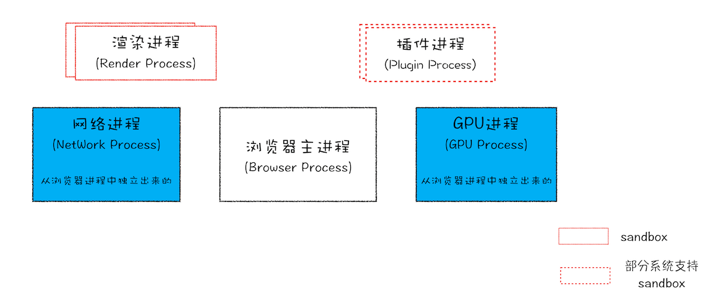

# Browser knowledge

## Basic knowledge

### Threads and processes

> Process and thread are the basic concepts of the operating system

A process is the smallest unit of CPU resource allocation (the smallest unit that can own resources and run independently)<br />
Thread is the smallest unit of CPU scheduling (a program running unit based on a process)<br />

**A process is a running instance of a program**: When starting a program, the operating system will create a memory for the program to store code, running data and a main thread for executing tasks. We refer to such a The running environment is called **process**

**A thread is an execution unit within a process**: A thread cannot exist alone. It is attached to the process and is started and managed by the process.

::: tip Characteristics of the relationship between processes and threads

- Process is the basic unit of resource ownership; thread is the basic unit of scheduling and allocation (it is an execution unit within the process and a schedulable entity within the process)
- Processes are isolated from each other and do not interfere with each other
- Multiple threads can be executed concurrently in a process
- A thread can only belong to one process, and a process can have multiple threads (but at least one main thread)
- All threads of the same process share all data of that process
- Any execution error in any thread in the process will cause the entire process to collapse.
- When a process is closed, the operating system will reclaim the memory occupied by the process

:::

### How many processes will there be when Chrome opens a page?

> The latest Chrome multi-process architecture diagram



- **Browser main process**: Responsible for interface display, user interaction, sub-process management, and also provides storage and other functions
- **Rendering Process**: Responsible for converting `HTML` `CSS` and `JavaScript` into web pages that users can interact with
  - The typesetting engine Blink and the JavaScript engine V8 both run in this process
  - By default Chrome creates a rendering process for each Tab
  - For security reasons, the rendering process runs in sandbox mode
- **GPU process**: Responsible for the drawing of web pages and Chrome's UI interface
- **Network Process**: Responsible for loading the network resources of the page (previously it ran as a module in the browser process)
- **Plugin Process**: Responsible for the running of the plug-in (because plug-ins are prone to crashing, they need to be isolated through the plug-in process to ensure that plug-in crashes will not affect the browser and the page)

[Chrome Architecture: Only 1 page is opened, why are there 4 processes? ——Browser working principle and practice](https://time.geekbang.org/column/article/113513)

## Cross domain

::: tip The reason for cross-domain - the browser’s same-origin policy

[Same origin policy](https://developer.mozilla.org/zh-CN/docs/Web/Security/Same-origin_policy) is an important security policy for browsers. It is used to restrict an `origin` document or How the script it loads can interact with resources from another source. It can help block malicious documents and reduce possible attack vectors

The definition of homology is that the **protocol**, **domain name** (subdomain name + main domain name), and **port number** of the two `URL` are the same, otherwise there will be cross-domain

:::

::: tip The restriction range of the same-origin policy

1. Restrict cross-origin network access: `AJAX` requests cannot be sent
2. Restrict cross-origin script `API` access: `DOM` cannot be obtained
3. Restrict cross-source data storage access: `Cookie` `LocalStorage` and `IndexDB` cannot be read

Generally speaking, cross-domain refers to network cross-domain

:::

### Commonly used cross-domain solutions

::: tip Commonly used cross-domain solutions

1. **CORS**
2. **JSONP**
3. Nginx reverse proxy
4. WebSocket
   5.postMessage
   6.document.domain

:::

### CORS cross-origin resource sharing

[CORS (Cross-Origin Resource Sharing)](https://developer.mozilla.org/zh-CN/docs/Web/HTTP/CORS) is [HTTP](https://developer.mozilla.org/zh-CN /docs/Glossary/HTTP), which allows the browser to issue `XMLHttpRequest` requests to cross-origin servers, thereby solving the limitation that `AJAX` can only be used from the same origin.

> `CORS` needs to be supported by both the browser and the server. Currently, all browsers support it. You only need to configure the server to use it.

Browsers divide `CORS` requests into two categories: **simple requests** and **non-simple requests**

#### Simple request

::: tip A simple request must meet the following conditions at the same time

> Daily development will only focus on the first two points

- The request method is one of the following three methods
  - `HEAD`
  - `GET`
  - `POST`
- Only the following security header fields are used, and other header fields are not allowed to be artificially set.
  - `Accept`
  - `Accept-Language`
  - `Content-Language`
  - `Content-Type` is limited to the following three types
    - `application/x-www-form-urlencoded`
    - `multipart/form-data`
    - `text/plain`
- No event listeners are registered for any `XMLHttpRequestUpload` objects in the request (use the `XMLHttpRequest.upload` property to access the `XMLHttpRequestUpload` object)
- No `ReadableStream` object was used in the request

:::

##### Simple request basic process

1. The browser will directly issue a `CORS` request and add an `Origin` field to the request header information (used to indicate which source the request comes from (protocol + domain name + port))
2. The server judges the `Origin` field to decide whether to agree to the request.
   1. Through the request, `CORS` related fields will be added to the response header (starting with `Access-Control-`)
   2. When rejecting a request, the `CORS` related fields will not be added, and the browser will throw an exception.

::: tip CORS field in simple request response header

- `Access-Control-Allow-Origin`: can only be `*` (accept requests from any domain name) or the value of the `Origin` field in the request
- `Access-Control-Allow-Credentials` (optional): is a Boolean value indicating whether to allow sending `Cookie`
- `Access-Control-Expose-Headers` (optional): When making a `CORS` request, the `getResponseHeader()` method of the `XMLHttpRequest` object can only get 6 basic fields: `Cache-Control, Content-Language, Content -Type, Expires, Last-Modified, Pragma`. If you want to get other fields, you must specify them in `Access-Control-Expose-Headers`

:::

::: tip Cookie settings in CORS

`CORS` requests do not send `Cookie` by default. If they need to be sent, the following conditions must be met.

- Server must set `Access-Control-Allow-Credentials: true`
- The `Access-Control-Allow-Origin` field cannot be `*`
- The configuration item requested by `AJAX` needs to be set to `withCredentials = true`

:::

#### Non-simple request

Non-simple requests are requests that have special requirements for the server, such as the request method is `PUT` or `DELETE`, or the type of the `Content-Type` field is `application/json`. <br />
Non-simple requests will add an `HTTP` query request before the formal communication, called a **preflight request**, which is used to obtain whether the server allows the actual request and to avoid cross-domain requests from causing unexpected effects on the server's user data. Impact

::: tip preflight request

The request method used for preflight requests is `OPTIONS`, indicating that this request is for inquiry

- The following fields will be included in the preflight request header information
  - `Origin`: indicates which source this request comes from
  - `Access-Control-Request-Method`: Used to list which `HTTP` methods will be used by the browser's `CORS` request
  - `Access-Control-Request-Headers` (optional): Specify the additional header fields that the browser will send in `CORS` requests.
- After the server passes, the following fields will be set in the preflight request response header.
  - `Access-Control-Allow-Origin`
  - `Access-Control-Allow-Credentials` (optional)
  - `Access-Control-Allow-Methods`: Represents all cross-domain request methods supported by the server (to avoid multiple preflight requests)
  - `Access-Control-Allow-Headers`: Indicates all header fields supported by the server, not limited to fields requested by the browser in preflight
  - `Access-Control-Max-Age` (optional): Used to specify the validity period of this preflight request in seconds. During the validity period, another preflight request will not be issued.

:::

Once the server passes the preflight request, every subsequent normal `CORS` request from the browser will have an `Origin` header field just like a simple request. The server's response will also have an `Access-Control-Allow-Origin` header field

::: details CORS request process

:::

[Reference material - Detailed explanation of CORS for cross-domain resource sharing](http://www.ruanyifeng.com/blog/2016/04/cors.html)

###JSONP

`JSONP` exploits the vulnerability of the `<script>` tag that does not have cross-domain restrictions. The current source can obtain `JSON` data dynamically generated from other sources.

**`JSONP` request process flow**

1. Define a parsed callback function on the front end
2. Create a `script` tag, whose `src` points to the interface address and splices the parameters and callback function name
3. The backend processes the data and splices it into the callback function passed in by the frontend (the spliced data must be a legal `JavaScript` script)
4. The browser executes the `JavaScript` script code returned by the backend (calls the defined callback function) and deletes the newly created `script` tag

::: details JSONP code implementation

```js
function normalizeParams(params) {
  if (!params) {
    return ''
  }
  returnObject
    .keys(params)
    .map((key) => `${key}=${params[key]}`)
    .join('&')
}

function jsonp(url, params) {
  return new Promise((resolve) => {
    const callback = `jsonp_${Date.now()}`
    window[callback] = function (data) {
      resolve(data)
      document.body.removeChild(scriptEle)
    }
    params.cb = callback
    const scriptEle = document.createElement('script')
    scriptEle.src = `${url}${url.includes('?') ? '&' : '?'}${normalizeParams(
      params
    )}`
    document.body.appendChild(scriptEle)
  })
}

jsonp('https://www.baidu.com/sugrec', {
  prod: 'pc',
  wd: 'Cross domain'
}).then((res) => {
  console.log(res)
})
```

:::

::: tip JSONP cross-domain advantages and disadvantages

- Advantages: simple implementation, good compatibility
- shortcoming
  - Only supports `GET` requests
  - Vulnerable to `XSS` attacks

:::

[To learn more about cross-domain solutions, please click - 10 cross-domain solutions](https://juejin.cn/post/6844904126246027278)

## Browser caching mechanism

- 1. The browser first determines whether the strong cache is hit before sending the request.
  - If there is a hit, the cache will be used directly without sending the request, otherwise proceed to the next step.
- 2. After the browser sends the request, the server will determine whether the negotiation cache is hit.
  - If there is a hit, obtain the resource from the cache, otherwise proceed to the next step.
- 3. The browser directly uses the resources returned by the server and updates the cache

### Strong cache (200 OK)

- `Expires` is the cache expiration time that the server tells the browser (the value is `GMT` time, that is, Greenwich Time)
  - A product of `HTTP1.0`
  - Affected by local time
  - The value set is `max-age=xxx` (xxx is seconds)
- `Cache-Control` is used to control cache behavior
  - A product of `HTTP1.1`
  - value
    - `public`: allowed to be cached by clients and proxy servers
    - `private`: only allowed to be cached by clients (default value)
    - `no-cache`: Allows caching by clients and proxy servers, but requires a negotiated cache to verify the decision when using the cache
    - `no-store`: All content will not be cached, that is, neither forced caching nor negotiated caching will be used. The complete resource will be downloaded on each request.
    - `maxage=xxx`: Set the cache time of the client and proxy server, indicating that the cached content will expire after xxx seconds
    - `s-maxage=xxx`: Set the cache time of the proxy server (higher priority than `max-age`)

::: warning Cache-Control Notes
The name `no-cache` is misleading. It does not mean that the data is not cached, but that when using the cache, the cache needs to be negotiated to verify the decision<br />
`max-age=0` has the same effect as `no-cache`
:::

#### Cache location

- memory cache
  - Fast reading (the memory cache will store the compiled and parsed files directly into the memory of the process, occupying a certain amount of memory resources of the process to facilitate fast reading during the next run)
  - Data will be cleared when the process is closed
  - No network resources are requested. Resources are stored in memory. Generally, `JS` and image files will be stored in memory.
  - Status code: `200 (from memory cache)`
- Disk cache
  - Write to hard disk files for `I/O` operations
  - Data will not be cleared when the process is closed
  - Slower than `memory cache`
  - Do not request network resources. Resources are stored in the disk. Generally, non-scripts will be stored in the disk, such as `css`
  - Status code: `200 (from disk cache)`
- Proxy server cache (server worker)
  - Can intercept all network requests for processing pages
  - Only available under `HTTPS`, there are compatibility issues
  - Status code: `200 (from service worker)`

### Negotiation cache (304 Not Modified)

#### `Last-Modified` and `If-Modified-Since`

`Last-Modified` represents the last modified time of the resource, the value is a `GMT` format time string, accurate to seconds

- When the browser makes the first request, the server will return the last update time of the requested resource `Last-Modified` in the response header.
- When the browser requests again, it will carry the `If-Modified-Since` value in the request header which is the `Last-Modified` returned by the last request.
- After the server receives the request, it will compare the `If-Modified-Since` in the request header with the last modification time of the resource on the server.
  - If it is greater than `If-Modified-Since`, the resource file will be returned with status code 200
  - If the resource is less than `If-Modified-Since` and has not been updated, the cache file will continue to be used, and the status code is 304.

::: Problems with tip Last-Modified

- Errors may occur when the time accuracy is second level, which cannot be met in scenarios that have strict requirements on file modification accuracy.
- File times on individual servers in a cluster may be different
- If you overwrite a new file with an old one, the browser will not request the old file because the time has changed.
- Editing the file but not modifying it will cause the cache to become invalid.

:::

#### ETag and If-None-Match

`ETag` is a unique identifier (file `hash`) calculated by the server on the resource content through an algorithm. It is divided into strong and weak ones.

- Strong `Etag`
  - `ETag: "<etag_value>"`
  - Any changes to resources will be updated immediately
  - Difficult to generate, easy to compare
- Weak `Etag` (use `W/` flag)
  - `ETag: W/"<etag_value>"`
  - Only update when the resource changes substantially
  - Easy to generate, not conducive to comparison

##### process

- When the browser makes the first request, the server will return a unique identifier of the current resource file `ETag` in the response header.
- When the browser requests again, it will carry the `If-None-Match` value in the request header which is the `ETag` returned by the previous request.
- Compare the received `ETag` with the `ETag` regenerated by the server
  - Inconsistent Return to resource file with status code 200
  - Consistent resources are not updated and continue to use the cache file, the status code is 304

::: tip Last-Modified and Etag comparison

- Accuracy: `Etag` is better than `Last-Modified`
- Performance: `Etag < Last-Modified` requires read and write operations every time `ETag` is generated, while `Last-Modified` only requires read operations
- Priority: Server verification gives priority to `Etag` (first determine whether `Etag` has changed, if `Etag` has not changed, then determine `Last-Modified`)

:::

### Application scenarios

| Strong cache                                                       | Negotiate cache                              |
| ------------------------------------------------------------------ | -------------------------------------------- |
| Files that change infrequently<br />Css js images with hash values | Files that change frequently<br />html files |

### The impact of user behavior on caching

- Address bar input
  - Check if there is a match in the `disk cache` (disk cache), if so, use the cache, if not, send a network request
- Normal refresh (F5)
  - Because the browser `tab` tag is not closed, `memory cache` (memory cache) is available and will be used first, followed by `disk cache` (disk cache)
  - Skip strong caching rules and go directly to negotiated caching
- Force refresh (Ctrl + F5)
  - The browser does not use caching, so the request headers sent are all sent with `Cache-control: no-cache` (`Pragma: no-cache` is also included for compatibility). The server directly returns 200 and the latest content.
  - Skip all caching rules

## Browser storage

### Cookies

`Cookie` (also called `Web Cookie` or browser `Cookie`) is a small piece of data sent by the server to the user's browser and saved locally. It will be carried the next time the browser makes a request to the same server. and sent to the server. Usually, it is used to tell the server whether two requests come from the same browser, such as keeping the user logged in. `Cookie` makes it possible to record stable state information based on the stateless `HTTP` protocol. `Cookie` exists in the form of key-value pairs when stored.

`Cookie` is mainly used in the following three aspects:

- Session state management (such as user login status, shopping cart, game scores or other information that needs to be recorded)
- Personalized settings (such as user-defined settings, themes, etc.)
- Browser behavior tracking (such as tracking and analyzing user behavior, etc.)

The main job of `Cookie` is not local storage, but "maintaining state". Since there was no other suitable storage method at the time, it was used as the only storage method, so it was used for local storage.

#### Generation and use of cookies

- Server generated, via `set-cookie` in `http response header`
- Use `document.cookie` in `JavaScript` for reading and writing

```js
/* read */
document.cookie

/* write */
document.cookie = 'name=maomao'
```

::: Disadvantages of tip Cookies

- `Cookie` can only have a maximum size of `4KB`. At the same time, most browsers also have limits on the number of `Cookie` for a site.
- All requests under the same domain name will carry `Cookie`, causing unnecessary overhead and security issues.

:::

### Web Storage

[Web Storage](https://developer.mozilla.org/zh-CN/docs/Web/API/Web_Storage_API) is a data storage mechanism provided by `HTML5` specifically for browser storage. Its size limit is `5MB ~ 10MB` ([Check the capacity limit of Web Storage under the current browser](http://dev-test.nemikor.com/web-storage/support-test/)), the data is only saved on the client and not communicated with the server communication

`Web Storage` provides two mechanisms for us to use

- `Local Storage`(local storage)
- `Session Storage` (session storage)

::: tip LocalStorage

- Saved data persists for a long time
- Share data between all tabs and windows from the same source

:::

::: tip SessionStorage

- Data only exists in the current browser tab
- **When opening a page in a new tab or window the context of the top browsing session is copied as the context of the new session**
  - When opening a page under the same domain in the current tab, the `SessionStorage` data in the current tab will be copied.
  - The copied `SessionStorage` data is independent and will not affect each other (similar to deep copy)
- Reloading or restoring the page will still maintain the original data
- Data will be cleared after closing the corresponding browser tab or window

:::

#### API usage

> Take `localStorage` as an example

```js
/* Store data setItem() */
localStorage.setItem('name', 'maomao')

/* Read data getItem() */
localStorage.getItem('name')

/* Delete the specified data removeItem() */
localStorage.removeItem('name')

/* Clear data clear() */
localStorage.clear()
```

::: tip The difference between sessionStorage localStorage and cookie

- Same point
  - All data is saved on the client side
  - The types of data stored are all strings
- difference
  - life cycle - `Coo
kie`: You can set the expiration time (the default is to expire after closing the browser) - `localStorage`: will be saved permanently unless cleared manually. - `sessionStorage`: only valid under the current browser tab, it will be cleared after closing the tab or window
  - Data size
    - `Cookie`: 4KB
    - `localStorage` and `sessionStorage`: `5MB ~ 10MB`
  - http request
    - `Cookie`: will be carried in the `HTTP` request header every time
    - `localStorage` and `sessionStorage`: only in client storage and will not communicate with the server

:::

### IndexedDB

[IndexedDB](https://developer.mozilla.org/zh-CN/docs/Web/API/IndexedDB_API) is a non-relational database that runs on the browser and is used to store large amounts of structured data on the client. data\*\*

::: tip Features of IndexedDB

- Large storage space (generally not less than `250MB` or even no upper limit)
- Supports storing binary data (`ArrayBuffer` and `Blob`)
- Key-value pair storage
- Same origin restriction
- The operations performed are performed asynchronously to avoid blocking the application
- Is a transactional database system

:::

#### API usage

Open/create an IndexedDB database and specify the version number of the database (the version number can only be an integer)

```js
const request = window.indexedDB.open('myDatabase', 1)
let db

// Success callback
request.onsuccess = function (event) {
  // Get indexedDB instance
  db = event.target.result
  // You can also use request.result to get the indexedDB instance
  console.log('Connection to IndexedDB successful')
}

//Failure callback
request.onerror = function () {
  console.log('Failed to connect to IndexedDB')
}
```

Create an object warehouse (similar to a table in a database)

```js
// The upgradeneeded event will be called when the database is initialized or the version is updated.
request.onupgradeneeded = function (event) {
  const db = event.target.result
  //Create an object warehouse and specify the primary key
  const objectStore = db.createObjectStore('userInfo', {
    keyPath: 'id',
    autoIncrement: false
  })
  console.log('Object warehouse created successfully')

  /**
   * Define the data items of the storage object
   * The first parameter is the name of the created index and can be empty
   * The second parameter is the key name used by the index and can be empty
   * The third parameter is an optional configuration parameter and does not need to be passed. One of the commonly used parameters is unique, which indicates whether the field is unique and cannot be repeated.
   */
  objectStore.createIndex('id', 'id', {
    unique: true
  })
  objectStore.createIndex('name', 'name')
}
```

adding data

```js
//Create a transaction and specify the table name and read and write permissions
const transaction = db.transaction(['userInfo'], 'readwrite')
// Get the Object Store object
const objectStore = transaction.objectStore('userInfo')

/* adding data */
objectStore.add({ id: 1, name: 'test' })
```

retrieve data

```js
const transaction = db.transaction(['userInfo'], 'readonly')
const objectStore = transaction.objectStore('userInfo')

const objectStoreRequest = objectStore.get(1)
objectStoreRequest.onsuccess = function () {
  console.log('Get data', objectStoreRequest.result)
}
```

change the data

```js
const transaction = db.transaction(['userInfo'], 'readwrite')
const objectStore = transaction.objectStore('userInfo')

const objectStoreRequest = objectStore.get(1)
objectStoreRequest.onsuccess = function () {
  const data = objectStoreRequest.result
  data.name = 'maomao'
  objectStore.put(data)
}
```

delete data

```js
const transaction = db.transaction(['userInfo'], 'readwrite')
const objectStore = transaction.objectStore('userInfo')

const objectStoreRequest = objectStore.delete(1)
objectStoreRequest.onsuccess = function () {
  console.log('Deletion successful')
}
```

::: tip In daily development, you can use the following class libraries to simplify the amount of code

- [localForage](https://github.com/localForage/localForage) A client-side data storage shim that provides a simple syntax of `name:value`, implemented based on `IndexedDB`, and can be used when `IndexedDB` is not supported The browser automatically falls back to `WebSQL` and `localStorage`
- [Dexie.js](https://github.com/dexie/Dexie.js) encapsulates `IndexedDB`, providing a more friendly and simple syntax for rapid coding development
- [PouchDB](https://github.com/pouchdb/pouchdb) encapsulates `IndexedDB`, providing a more friendly and simple syntax for rapid coding development

:::
