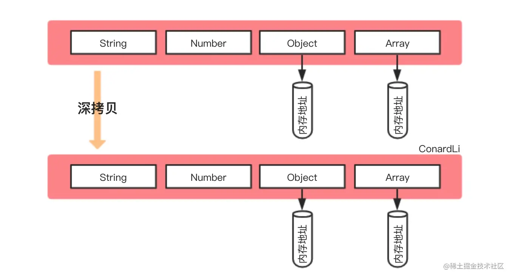

#Copy of reference type

::: tip Review the characteristics of reference types

- Because `JavaScript` does not allow direct access to memory locations (that is, the memory space where the reference type is located cannot be directly manipulated), so the reference type stores the address (that is, the memory pointer) in **stack memory**, and the reference type Data (methods or properties) are stored in **heap memory**
- Variables that hold reference types are **accessed by reference**. When we access and operate an object, we actually operate a reference to the object rather than the actual object itself.
- When copying reference types, only the memory pointer will be copied

:::

Therefore, when we copy and modify reference types during the development process, we need to pay attention to the impact on the original data according to the scene requirements.

> TIP: Use objects in reference types as representatives 🌰

## Shallow copy


> Picture comes from [How to write a deep copy that amazes the interviewer?](https://juejin.cn/post/6844903929705136141)

Shallow copy is to create a new object. This object has an exact copy of the original object's attribute value: the basic type copies the value, and the reference type copies the memory address; so when we operate the reference type in the new object, it will Impact source object\*\*

### Object.assign()

```js
const obj1 = {
  name: 'maomao',
  props: { a: 1 }
}

const obj2 = Object.assign({}, obj1)
obj2.name = 'Maomao'
obj2.props.a++

obj1 // { name: 'maomao', props: { a: 2 } }
obj2 // { name: 'Maomao', props: { a: 2 } }
```

### `Array.prototype.concat()`

```js
const arr1 = [1, 2, 3, [4, 5]]

const arr2 = arr1.concat()
arr2[0] = 'arr2'
arr2[3][0] = 'arr2'

arr1 // [1, 2, 3, ['arr2', 5]];
arr2 // ['arr2', 2, 3, ['arr2', 5]];
```

### `Array.prototype.slice()`

```js
const arr1 = [1, 2, 3, [4, 5]]

const arr2 = arr1.slice()
arr2[0] = 'arr2'
arr2[3][0] = 'arr2'

arr1 // [1, 2, 3, ['arr2', 5]];
arr2 // ['arr2', 2, 3, ['arr2', 5]];
```

### `ES6` spread operator

```js
/* object */
const obj1 = {
  name: 'maomao',
  props: { a: 1 }
}

const obj2 = { ...obj1 }
obj2.name = 'Maomao'
obj2.props.a++

obj1 // { name: 'maomao', props: { a: 2 } }
obj2 // { name: 'Maomao', props: { a: 2 } }

/* array */
const arr1 = [1, 2, 3, [4, 5]]

const arr2 = [...arr1]
arr2[0] = 'arr2'
arr2[3][0] = 'arr2'

arr1 // [1, 2, 3, ['arr2', 5]];
arr2 // ['arr2', 2, 3, ['arr2', 5]];
```

## Deep copy



Deep copy is to make a complete copy of an object from memory, that is, to open a new area in the heap memory to store the new object, so **modifying the new object will not affect the original object**

### `JSON.parse(JSON.stringify())`

```js
const obj1 = {
  name: 'maomao',
  props: { a: 1 }
}

const obj2 = JSON.parse(JSON.stringify(obj1))
obj2.name = 'Maomao'
obj2.props.a++

obj1 // { name: 'maomao', props: { a: 1 } }
obj2 // { name: 'Maomao', props: { a: 2 } }
```

**`JSON.parse(JSON.stringify())` has obvious disadvantages:**

- Only enumerable own properties of an object can be serialized
- `undefined`, `Symbol`, any function will be ignored
- `NaN`, `Infinity`, `-Infinity` will be treated as `null`
- Special objects such as `RegExp`, `Error`, `Set`, and `Map` will only serialize enumerable properties (usually empty objects)
- `Date` type, after conversion, `toJSON` will be called to convert to string type
- Objects with circular references will report an error

```js
const map = new Map()
map.set(1, 2) // Map: 0: {1 => 2}
const obj1 = {
  a: undefined,
  b: null,
  c: Symbol(),
  d: NaN,
  e: Infinity,
  f: -Infinity,
  g: map,
  h: new Date(),
  i: () => {}
}
Object.defineProperty(obj1, 'j', {
  value: 'string'
})

const obj2 = JSON.parse(JSON.stringify(obj1))

/** Source object obj1
{
   a: undefined,
   b: null,
   c: Symbol(),
   d: NaN,
   e: Infinity,
   f: -Infinity,
   g: Map(1) {1 => 2}
   h: Fri Mar 10 2023 22:41:08 GMT+0800 (China Standard Time) {},
   i: () => {},

   j: 'string'
}
**/

/** New object obj2
{
   b: null,
   d: null,
   e: null,
   f: null,
   g: {},
   h: '2023-03-10T14:41:08.110Z'
}
**/
```

### `structuredClone`

> `HTML` standard [Web API](https://developer.mozilla.org/zh-CN/docs/Web/API/structuredClone)

```js
const original = { name: 'MDN' }
original.itself = original

const clone = structuredClone(original)

console.assert(clone !== original) // the objects are not the same (not same identity)
console.assert(clone.name === 'MDN') // they do have the same values
console.assert(clone.itself === clone) // and the circular reference is preserved
```

A standard proposal for the `HTML` specification that uses the structured cloning algorithm to make a deep copy of a given value, supporting circular references. You can also use the `structuredClone(value, { transfer })` calling method so that the transferable object is only transferred and not cloned (the source data is moved directly)

:::warning Notes

Although `Web API` is implemented as a specification standard, compatibility is still a huge problem at present, and there are still other shortcomings:

- Unable to copy object's prototype chain
- Unable to copy function
- `Error` data type is not supported

:::

### `MessageChannel`

> The `vue.nextTick` source code used `Web API`. When I learned about this `API`, I found that it can be used for deep copying.

```js
function cloneUsingChannel(obj) {
  return new Promise((resolve) => {
    const channel = new MessageChannel()
    channel.port1.onmessage = (e) => resolve(e.data)
    channel.port2.postMessage(obj)
  })
}
```

But there is a flaw in this method. When the copied object has function attributes, an error will be thrown:

```js
const obj1 = {
  fn: function () {}
}
const obj2 = cloneUsingChannel(obj1)
// Uncaught (in promise) DOMException: Failed to execute 'postMessage' on 'MessagePort': function () {} could not be cloned.
```

### `JQuery.extend()`

```js
import $ from 'jquery'

const obj2 = $.extend(true, {}, obj1)
```

### `lodash.cloneDeep`

```js
import { cloneDeep } from 'lodash-es'

const obj2 = cloneDeep(obj1)
```
