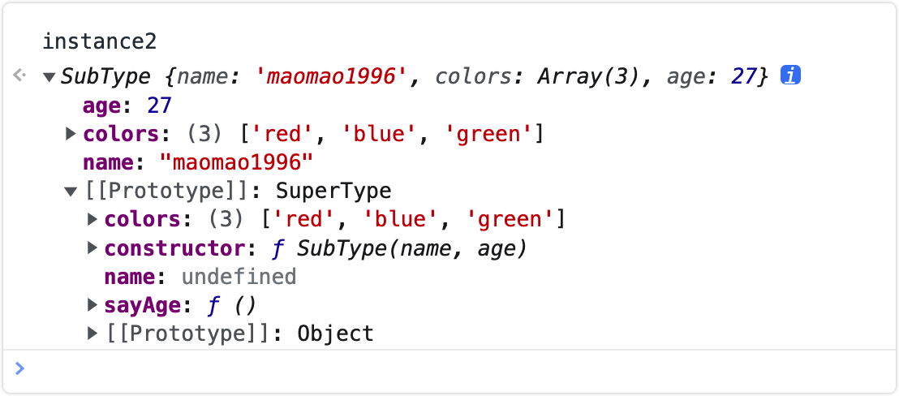
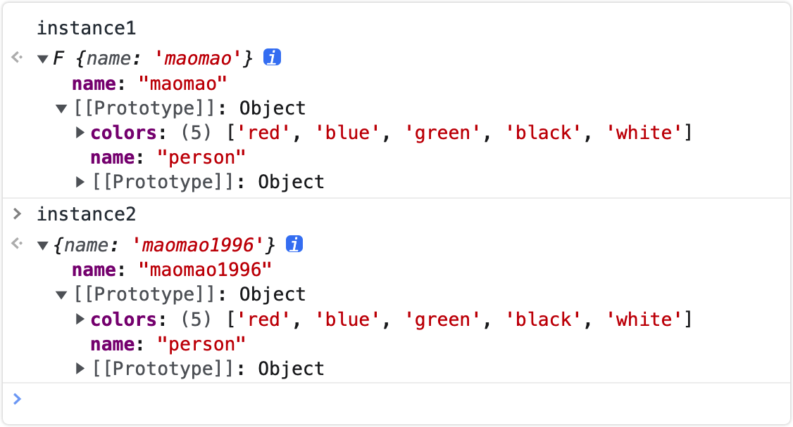
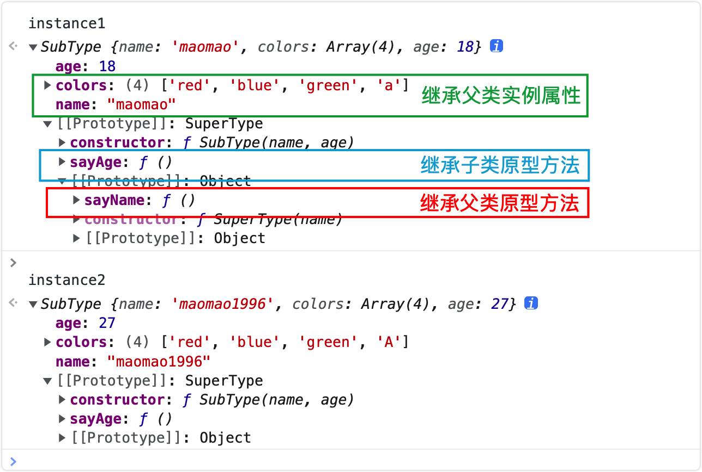

#Inheritance

::: tip Tips
Read ["JavaScript Advanced Programming (4th Edition)"](https://www.ituring.com.cn/book/2472) and the summary summarized in the articles of various experts. **If you have any objection, please press your Understand first**
:::

Inheritance is one of the most talked-about concepts in object-oriented programming. It describes the parent-child relationship between classes. Its main function is to improve code reusability and make the code more concise.

Many object-oriented languages support two types of inheritance:

- Interface inheritance: only inherit method signatures
- Implement inheritance: directly inherit the actual method

Interface inheritance is not possible in `ECMAScript` because functions have no signatures, so implementation inheritance is the only inheritance method supported by `ECMAScript`, and its **implementation inheritance mainly relies on the prototype chain**.

## Prototype chain inheritance

The relationship between constructors, prototypes and instances: Each constructor has a prototype object, the prototype has a property pointing back to the constructor, and the instance has an internal pointer pointing to the prototype. What if the prototype is an instance of another type? That means that the prototype itself has an internal pointer to another prototype, which in turn has a pointer to another constructor. This creates a prototype chain between the instance and the prototype. This is the basic idea of the prototype chain

::: tip prototype chain inheritance

Prototype chain inheritance is to use the instance of the parent class as the prototype of the subclass by overriding the prototype of the subclass\*\*

shortcoming

- Reference type attributes on the parent class will be shared by all instances. Modification of one instance will affect other instances.
- When creating a subclass instance, parameters cannot be passed to the parent class constructor.

:::

```js {14,23,28}
function SuperType() {
  this.property = 'Super'
  this.colors = ['red', 'blue', 'green']
}

SuperType.prototype.getSuperValue = function () {
  return this.property
}

function SubType() {
  this.subproperty = false
}

// Key point: Create an instance of the parent class SuperType and assign it to the prototype of the subclass SubType.prototype
SubType.prototype = new SuperType()

SubType.prototype.getSubValue = function () {
  return this.subproperty
}

const instance1 = new SubType()
console.log('instance1', instance1.getSuperValue()) // 'Super'
// Modify the reference attribute on the parent class on one of the subclass instances
instance1.colors.push('black')

const instance2 = new SubType()
console.log('instance2', instance2.getSuperValue()) // 'Super'
// Output the reference attribute on the parent class on another subclass instance
console.log('instance2', instance2.colors) // ['red', 'blue', 'green', 'black']
```

## Borrowing constructor inheritance (classic inheritance)

::: tip Borrowing constructor inheritance (classic inheritance)

Borrowing constructor inheritance is **using the parent class's constructor to enhance the child class instance** which is equivalent to copying the instance of the parent class to the child class (without using a prototype)

shortcoming

- Methods are defined in the constructor, and each time an instance is created, the method will be created (affecting performance)
- You can only inherit instance properties and methods from the parent class, but not prototype properties and methods.

:::

```js
function SuperType(name) {
  this.name = name
  this.colors = ['red', 'blue', 'green']
  this.log = function () {
    console.log(this.name)
  }
}

function SubType(name) {
  //Inherit SuperType
  SuperType.call(this, name)
}

const instance1 = new SubType('maomao')
instance1.colors.push('black')
console.log('instance1', instance1.name) // 'maomao'
console.log('instance1', instance1.colors) // ['red', 'blue', 'green', 'black']

const instance2 = new SubType('maomao1996')
console.log('instance2', instance2.name) // 'maomao1996'
console.log('instance2', instance2.colors) // ['red', 'blue', 'green']

console.log(instance1.log === instance2.log) // false
```

## Combination inheritance

::: tip combined inheritance

Combination inheritance (sometimes also called pseudo-classical inheritance) is a combination of the above two inheritances, which combines the advantages of both. The basic idea is to use the prototype chain to inherit the properties and methods on the prototype, and to inherit the instance properties by borrowing the constructor. In this way, methods can be defined on the prototype to achieve function reuse, and each instance can have its own attributes.

- Advantages: It makes up for the shortcomings of the prototype chain and borrowed constructors, and is the most commonly used inheritance pattern in JavaScript. Moreover, combined inheritance also retains the ability of the `instanceof` operator and the `isPrototypeOf()` method to identify synthetic objects.
- Disadvantage: Because the constructor of the parent class is called twice, the instance attributes and methods in the parent class exist in both the instance of the subclass and the prototype of the subclass.

:::

```js
function SuperType(name) {
  // define properties
  this.name = name
  this.colors = ['red', 'blue', 'green']
}
// define method
SuperType.prototype.sayName = function () {
  console.log(this.name)
}

function SubType(name, age) {
  //Inherited properties (second call: called when creating a subclass instance)
  SuperType.call(this, name)
  this.age = age
}

// Inherited method (first call: called when assigning a value to the subclass prototype)
SubType.prototype = new SuperType()
SubType.prototype.constructor = SubType
SubType.prototype.sayAge = function () {
  console.log(this.age)
}

const instance1 = new SubType('maomao', 18)
instance1.colors.push('black')
console.log('instance1', instance1.colors) // ['red', 'blue', 'green', 'black']
instance1.sayName() // 'maomao'
instance1.sayAge() // 18

const instance2 = new SubType('maomao1996', 27)
console.log('instance2', instance2.colors) // ['red', 'blue', 'green']
instance2.sayName() // 'maomao1996'
instance2.sayAge() // 27
```

Illustration of disadvantages of combined inheritance



## Prototypal inheritance

::: tip Prototypal inheritance

Prototypal inheritance is **using an empty object as an intermediary to directly assign an object to the prototype of the empty object constructor**

Disadvantages (same as prototype chain inheritance)

- Reference type properties are shared by all instances, and modifications to one instance will affect other instances.
- Unable to pass parameters
- Each time an object is created, a method will be created

:::

```js
// Borrow the temporary constructor, use the incoming object as its prototype object and return its instance
function object(obj) {
  function F() {}
  F.prototype = obj
  return new F()
}
```

The `object()` method is a simulated implementation of `ES5` `Object.create`: **use the passed in object as the prototype of the created object**

```js
const person = {
  name: 'person',
  colors: ['red', 'blue', 'green']
}
const instance1 = object(person)
instance1.name = 'maomao'
instance1.colors.push('black')

const instance2 = Object.create(person)
instance2.name = 'maomao1996'
instance2.colors.push('white')
console.log(person.colors) // ['red', 'blue', 'green', 'black', 'white']
```

::: warning Notes

When modifying `instance1.name`, the value of `instance2.name` has not changed, not because `instance1` and `instance2` have independent `name` values, but because `instance1.name = 'maomao'` The `name` value is added to `instance1`, not the `name` value on the prototype is modified.



:::

## Parasitic inheritance

::: tip Parasitic inheritance

Parasitic inheritance is close to prototypal inheritance. Its main implementation** is to create a function that implements inheritance, enhance the object in some way, and then return this object**

shortcoming

- Reference type properties are shared by all instances, and modifications to one instance will affect other instances.
- Unable to pass parameters
- Each time an object is created, a method will be created

:::

```js
function createAnother(original) {
  //Create a new object via Object.create
  const clone = Object.create(original)

  // Enhance this object in some way (add new properties and methods)
  clone.sayHi = function () {
    console.log('hi')
  }

  //Return this object
  return clone
}

const person = {
  name: 'person',
  colors: ['red', 'blue', 'green']
}

const instance1 = createAnother(person)
instance1.colors.push('black')
instance1.sayHi() // 'hi'

const instance2 = createAnother(person)
instance2.sayHi() // 'hi'
console.log('instance2', instance2.colors) // ['red', 'blue', 'green', 'black']

console.log(instance1.sayHi === instance2.sayHi) // false
```

## Parasitic combined inheritance

::: tip Parasitic Combinatorial Inheritance
Parasitic combined inheritance improves combined inheritance and optimizes the problem of calling the parent class constructor twice, resulting in the best inheritance method before `ES6`: **Inherit properties by borrowing constructors, and then use parasitic inheritance To inherit the parent class prototype, and then assign the returned new object to the subclass prototype**

Advantages: The parent class constructor is only called once, and thus avoids creating unnecessary and redundant properties on the parent class prototype. At the same time the prototype chain remains unchanged; therefore `instanceof` and `isPrototypeOf` can still be used normally
:::

```js
function inheritPrototype(subType, superType) {
  //Create object: Create a copy of the parent class prototype
  const prototype = Object.create(superType.prototype)
  // Enhanced object: solve the problem of default constructor being lost due to overriding the prototype
  prototype.constructor = subType
  //Specify object: assign the newly created object to the prototype of the subclass
  subType.prototype = prototype
}

//The parent class initializes instance properties and prototype properties
function SuperType(name) {
  this.name = name
  this.colors = ['red', 'blue', 'green']
}
SuperType.prototype.sayName = function () {
  alert(this.name)
}

// Borrow constructor to pass enhanced subclass instance attributes (support parameter passing and avoid tampering)
function SubType(name, age) {
  SuperType.call(this, name)
  this.age = age
}

// Point the parent class prototype to the child class
inheritPrototype(SubType, SuperType)

//Add subclass prototype attributes
SubType.prototype.sayAge = function () {
  alert(this.age)
}

const instance1 = new SubType('maomao', 18)
instance1.colors.push('a') // ['red', 'blue', 'green', 'a']

const instance2 = new SubType('maomao1996', 27)
instance2.colors.push('A') // ['red', 'blue', 'green', 'A']
```



## ES6 class inheritance extends

> The `class` of `ES6` is just a syntax sugar, which is still essentially a function. Most of its functions can be achieved by `ES5`. The new `class` way of writing just makes the object prototype more convenient. Clear, more like object-oriented programming syntax

`class` can achieve inheritance through the `extends` keyword, allowing subclasses to inherit the properties and methods of the parent class. The writing method of `extends` is much clearer and more convenient than the prototype chain inheritance of `ES5`

```js
class Point {
  constructor(x, y) {
    this.x = x
    this.y = y
  }
  toString() {
    return this.x + '' + this.y
  }
}

class ColorPoint extends Point {
  constructor(x, y, color) {
    super(x, y) // Call the parent class's constructor(x, y)
    this.color = color
  }

  toString() {
    return this.color + ' ' + super.toString() // Call the toString() of the parent class
  }
}

const colorPoint = new ColorPoint('1', '2', 'red')
console.log(colorPoint.toString()) // red 12
```

::: tip The inheritance mechanism of ES5 and ES6

- `ES5` inheritance mechanism
  - First create an instance object of an independent subclass, and then add the methods of the parent class to this object, that is, **instance first, inheritance last**
- `ES6` inheritance mechanism
  - First add the attributes and methods of the parent class to an empty object, and then use the object as an instance of the subclass, that is, **inheritance first, instance last**

:::

[Understand the implementation principle behind it through babel compilation](https://babeljs.io/repl/#?browsers=&build=&builtIns=false&corejs=false&spec=false&loose=true&code_lz=MYGwhgzhAEAKD2BLAdgF2gbwFDWseyEqATgK7CrzEAUAHgDTQCeAlJjrtKgBaIQB0taAF5otD rh59-TEcw4BfLEqyhIMAMLwQVBCnQBTWqgPIAJjD1p2ufIRLlKNBs0b4dxNtk7QIpAA4GzoysEly8Au5UclHEispAA&debug=false&forceAllTransforms=false&shippedProposals=false&circleciRepo=&evaluate =true&fileSize=false&timeTravel=false&sourceType=module&lineWrap=false&presets=env&prettier=false&targets=&version=7.15.3&externalPlugins=&assumptions=%7B%7D)

```js
// Implement inheritance (similar to ES5's parasitic composable inheritance)
function _inheritsLoose(subClass, superClass) {
  subClass.prototype = Object.create(superClass.prototype)
  subClass.prototype.constructor = subClass
  _setPrototypeOf(subClass, superClass)
}

// Simulate ES6's Reflect.setPrototypeOf method
function _setPrototypeOf(o, p) {
  _setPrototypeOf =
    Object.setPrototypeOf ||
    function _setPrototypeOf(o, p) {
      o.__proto__ = p
      return o
    }
  return _setPrototypeOf(o, p)
}

// Parent class constructor
var Point = function Point(x, y) {
  this.x = x
  this.y = y
}

// Subclass constructor
var ColorPoint = /*#__PURE__*/ (function (_Point) {
  _inheritsLoose(ColorPoint, _Point)

  function ColorPoint(x, y, color) {
    var_this

    _this = _Point.call(this, x, y) || this
    _this.color = color
    return_this
  }

  returnColorPoint
})(Point)
```

## Summarize

- Prototype chain inheritance: By rewriting the prototype of the subclass **use the instance of the parent class as the prototype of the subclass**
- Borrowed constructor inheritance: **Using the constructor of the parent class to enhance the subclass instance** is equivalent to copying the instance of the parent class to the subclass (without using a prototype)
- Combined inheritance: **Use the prototype chain to inherit properties and methods on the prototype, and inherit instance properties by borrowing constructors**
- Prototypal inheritance: **Use an empty object as an intermediary to directly assign an object to the prototype of the empty object constructor**
- Parasitic inheritance: **Create a function that implements inheritance, enhance the object in some way, and then return this object**
- Parasitic combined inheritance: **Inherit properties by borrowing constructors, then use parasitic inheritance to inherit the parent class prototype, and then assign the returned new object to the child class prototype**

## related articles

- [Eight commonly used inheritance schemes in JavaScript](https://github.com/yygmind/blog/issues/7)
- [Various methods, advantages and disadvantages of JavaScript in-depth inheritance](https://github.com/mqyqingfeng/Blog/issues/16)
- [How Babel compiles Class in ES6 series (Part 2)](https://github.com/mqyqingfeng/Blog/issues/106)
