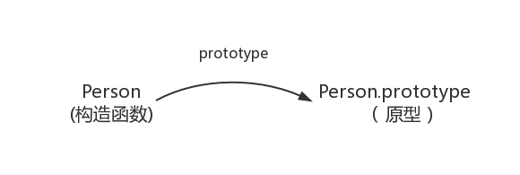
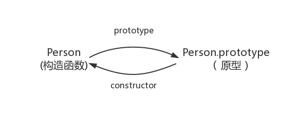
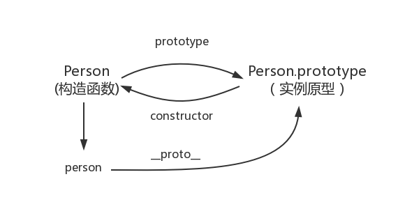
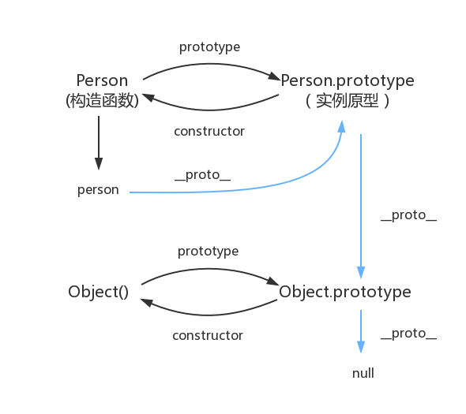

# Prototype and prototype chain

Prototype and prototype chain are very important concepts in `JavaScript`, which are very important for understanding the object model and inheritance of `JavaScript`. Through prototypes and prototype chains, we can implement multiple inheritance methods such as prototype-based inheritance, parasitic inheritance, and combined inheritance, making the code more concise, readable, and easy to maintain.

## Constructor and instance

Using the `new` operator and constructor is one of the common ways to create objects. A constructor is a special function that is used to create a new object instance. When we call a function using the `new` operator, it becomes a constructor because it is used to construct a new object instance.

```js
// Constructor
function Person(name) {
  this.name = name
}

//Object instance
const person1 = new Person('maomao')
console.log(person1) // Person {name: 'maomao'}
```

::: Characteristics of tip constructor

1. Function names usually start with a capital letter to distinguish them from ordinary functions (there is essentially no difference)
   1. **The function that uses the `new` operator to generate an instance is the constructor**
   2. **Functions called directly are ordinary functions**
2. The `this` keyword is usually used in the constructor to refer to the object instance to be created.
3. Properties or methods are usually used in constructors to define the state and behavior of new object instances.

:::

## `prototype`

In `JavaScript`, every function has a prototype attribute `prototype`, which points to the prototype of the instance created by calling the constructor (the prototype can be `null` or other objects)



Properties and methods defined on the prototype object (`prototype`) will be shared by object instances

```js
function Person() {}

Person.prototype.name = 'maomao'

//Object instance person1
const person1 = new Person()
//Object instance person2
const person2 = new Person()

console.log(person1.name, person2.name) // 'maomao' 'maomao'
```

## `constructor`

Each prototype object `prototype` has a `constructor` property, which **points to the prototype's constructor**

```js
function Person() {}
Person.prototype // { constructor: ƒ Person(name) }

Person.prototype.constructor === Person // true
```



## `__proto__`

In `JavaScript`, every object has a `__proto__` attribute, which points to the `prototype` of the function that created the object, that is, the prototype of the constructor (also called a private prototype)

::: warning `__proto__` Notes

`__proto__` is used to read or set the prototype object of the current object. It is essentially an internal property, not a formal external `API`. It was only added to `ES6` to ensure that it is widely supported by browsers. Web`browser compatibility, and this attribute is no longer recommended. In actual development, it is more recommended to use`JavaScript` provided by ES6

- Read the prototype object of the current object
  - [Object.getPrototypeOf](https://developer.mozilla.org/zh-CN/docs/Web/JavaScript/Reference/Global_Objects/Object/getPrototypeOf)
  - [Reflect.getPrototypeOf](https://developer.mozilla.org/zh-CN/docs/Web/JavaScript/Reference/Global_Objects/Reflect/getPrototypeOf)
- Set the prototype object of the current object
  - [Object.setPrototypeOf](https://developer.mozilla.org/zh-CN/docs/Web/JavaScript/Reference/Global_Objects/Object/setPrototypeOf)
  - [Reflect.setPrototypeOf](https://developer.mozilla.org/zh-CN/docs/Web/JavaScript/Reference/Global_Objects/Reflect/setPrototypeOf)

:::

```js
// Constructor
function Person(name) {
  this.name = name
}

//Object instance
const person = new Person('maomao')

person.__proto__ === Person.prototype // true
Object.getPrototypeOf(person) === Person.prototype // true
Reflect.getPrototypeOf(person) === Person.prototype // true
```



## Prototype chain

Each object has a prototype object, which points to the previous prototype through the `__proto__` pointer, and inherits methods and properties from it. At the same time, the prototype object may also have a prototype, layer by layer, and finally points to `null`. This **chain structure** is called **prototype chain**.



::: tip `Object.prototype.__proto__ === null`
`Object.prototype` is the prototype for all objects in `JavaScript`. It defines properties and methods that can be used by all `JavaScript` objects, such as `toString()` `hasOwnProperty()`, etc.<br />
At the same time, `Object.prototype` itself is an object, so it also has a prototype, and that prototype is `null`, which is the top of the `JavaScript` prototype chain. Therefore `Object.prototype.__proto__ === null` (to give the prototype chain an end)
:::

Through the prototype chain, an object will have properties and methods defined in other objects, so that properties and methods can be shared between objects, thereby avoiding duplication of code.

So when we try to access a property of an object, `JavaScript` first looks for the property in the object itself. If it doesn't find the property, it keeps looking in the object's prototype, then in the prototype's prototype, and so on until it finds the property or the top of the prototype chain

## `Object` and `Function`

> These are all conclusions and summaries for yourself.

### Reference types are all objects

In `JavaScript` **all reference types are objects (a function is a function object)**, and an object is a collection of properties.

> That is, the reference types are all subclasses of `Object`

```js
/* Define properties for the object */
const obj = { a: 'obj' }

/* Define attributes for the array */
const arr = []
arr.a = 'arr' // 'arr'

/* Define attributes for the function */
const fn = function () {}
fn.a = 'fn' // 'fn'
```

### `Function`

Definition on `ECMAScript` ([15.3.3](http://www.ecma-international.org/ecma-262/5.1/#sec-15.3.3))

> The Function constructor is itself a Function object and its [[Class]] is "Function". The value of the [[Prototype]] internal property of the Function constructor is the standard built-in Function prototype object.

The `Function` constructor is a function object whose `[[Class]]` property is `Function`. The `[[Prototype]]` (i.e. `__proto__`) attribute of `Function` points to `Function.prototype`

::: tip `Function.prototype` Notes

`Function.prototype` is a function, but it does not have a `prototype`, and the function object created by the `Function.prototype.bind()` method does not have a `prototype` either.

```js
typeof Function.prototype // 'function'

const fn = Function.prototype.bind()
// ƒ () { [native code] }

fn.prototype // undefined
```

`Function.prototype` is a function created by the engine. The engine believes that there is no need to add the `prototype` attribute to this function object, otherwise `Function.prototype.prototype` will be endless and have no meaning of existence.

:::

At the same time, each `JavaScript` function is actually a `Function` object, that is, an instance of `Function`

So there are these strange phenomena

```js
Function instanceof Object // true
//actually as follows
Object.__proto__ === Function.prototype // true

Object instanceof Function // true
//actually as follows
Function.__proto__.__proto__ === Object.prototype // true

Function instanceof Function // true
//actually as follows
Function.__proto__ === Function.prototype // true
```

> Classic pictures


## Summarize

- All reference types (arrays, objects, functions) are objects (objects are collections of properties)
- All functions are instances of `Function`
- `Object.prototype` and `Function.prototype` are two special objects created by the engine according to the `ECMAScript` specification
- All functions have a `prototype` attribute (prototype) pointing to the prototype of the instance created by calling the constructor
- All objects have a `__proto__` attribute (implicit prototype) pointing to the `prototype` of the function that created the object (implicit prototype of the instance === prototype of the constructor)
- Each object has a prototype object, which points to the previous prototype through the `__proto__` pointer. At the same time, the prototype object may also have a prototype, layer by layer, and finally points to `null`. This**chain typeThe structure** is called the **prototype chain**

## related articles

- [In-depth understanding of javascript prototypes and closures](https://www.cnblogs.com/wangfupeng1988/p/3977924.html)
- [Javascript Object Hierarchy](http://www.mollypages.org/tutorials/js.mp)
- [JavaScript The birth of all things in the world](https://zhuanlan.zhihu.com/p/356980105)
- [Some gains from exploring `Function.__proto__ === Function.prototype`](https://github.com/jawil/blog/issues/13)
- [In-depth exploration of the Function & Object egg problem](https://github.com/yygmind/blog/issues/35)
