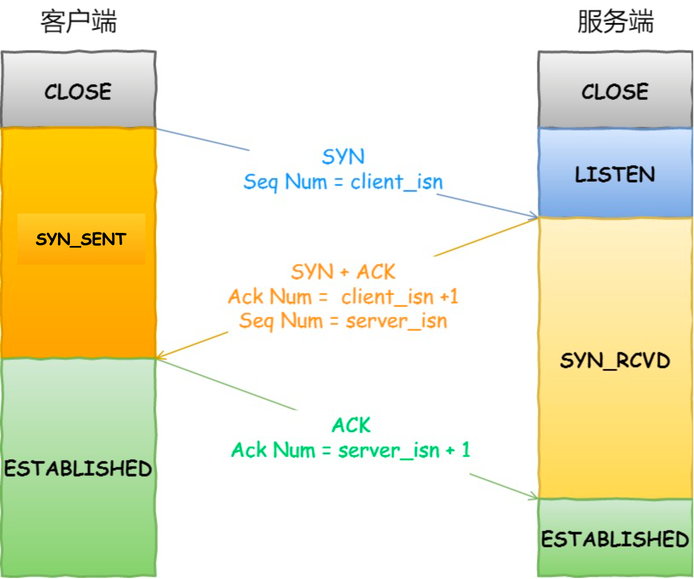
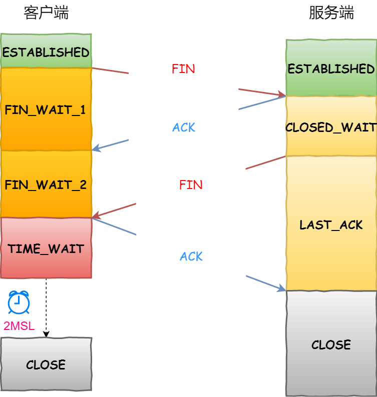

#TCP

TCP (Transmission Control Protocol) is a **connection-oriented**, **reliable**, **based on byte stream** transport layer communication protocol

::: tip TCP connection

A TCP connection is a combination of certain state information, including socket, sequence number, and window size, used to ensure reliability and flow control maintenance.

- **Socket**: consists of IP address and port number
- **Serial Number**: Used to solve out-of-order problems, etc.
- **Window size**: used for flow control

:::

::: tip TCP quadruple

- source address
- source port
- Destination address
- destination port

TCP four-tuple can uniquely identify a connection

:::

## Three handshakes

> TCP connection established

**Three-way handshake** means that when establishing a TCP connection, the client and server must **send a total of 3 data packets to confirm the establishment of the connection**

The three-way handshake process is shown in the figure below:

Initially both client and server are in `CLOSED` state. Then the server actively listens on a certain port (at this time in the `LISTEN` state)

### First handshake

> **Initiated by client**

The client will randomly initialize a sequence number (`client_isn`) and then send a packet with `SYN` `seq = client_isn` information. After the sending is completed, the client enters the `SYN_SEND` state (connection sending state)

- `SYN` is a flag bit. When it is 1, it means that you want to establish a connection.
- `seq = client_isn` is the client's randomly initialized sequence number (a 32-bit unsigned number)

### Second handshake

> **Initiated by server**

After receiving the `SYN` message from the client, the server will first randomly initialize its own sequence number (`server_isn`) and then send a message with `SYN` `ACK` `seq = server_isn` `ack = client_isn + 1` information. data pack. After the sending is completed, the server enters the `SYN_RCVD` state (connection received state)

- `ACK` is a flag indicating that the request has been received
- `seq = server_isn` is the server's randomly initialized sequence number (a 32-bit unsigned number)
- `ack = client_isn + 1` is a confirmation response number, the value is **client serial number + 1**

### The third handshake

> **Initiated by client**

After receiving the server message, the client will send another data packet with `ACK` `ack = server_isn + 1` information. After the sending is completed, the client enters the `ESTABLISHED` state (connection is successful). The server will also enter the `ESTABLISHED` state after receiving the response packet sent by the client.

- `ack = server_isn + 1` is a confirmation response number, the value is **server serial number + 1**

::: tip The three-way handshake ensures that the client and server can confirm whether the receiving and sending capabilities of both parties are normal.

- First handshake: the client sends a `SYN` message to the server, and the server receives the message
  - The client cannot confirm anything
  - Server confirmation: It receives normally and the other party sends normally.
- Second handshake: The server sends a `SYN + ACK` message to the client, and the client receives the message
  - The client confirms: it sends and receives normally, and the other party sends and receives normally.
  - Server confirmation: It receives normally and the other party sends normally.
- The third handshake: the client sends an `ACK` message to the server
  - The client has completed the confirmation during the second handshake
  - Server confirmation: It sends normally and receives normally, and the other party sends normally and receives normally.

:::

### What is the role of the three-way handshake?

1. Prevent old duplicate connection initialization from causing confusion
2. Synchronize the initial sequence numbers of both parties (the sequence number can ensure that data packets are not repeated, discarded and transmitted in order)
3. Avoid waste of resources

### Why not two handshakes?

Two handshakes cannot prevent the establishment of historical connections, will cause a waste of resources on both sides, and cannot reliably synchronize the serial numbers of both parties.

### Why not a four-way handshake?

Because a reliable connection can be established through the first three times, sending a fourth confirmation message will waste resources, so there is no need to use more communication times.

### Can data be carried during the three-way handshake?

The first and second handshakes cannot carry data, but the third handshake can carry data, because the client is already connected during the third handshake and already knows that the server's receiving and sending capabilities are normal.

## Wave four times

> TCP connection dropped

**Four waves** means that when a TCP connection is disconnected, the client and server send a total of **4 packets to confirm the disconnection** 
**Both the client and the server can actively disconnect**

The process of waving four times is shown in the figure below:

Initially both client and server are in `ESTABLISHED` state

### The first wave

The client first sends a data packet with `FIN=1` information, and then the client enters the `FIN_WAIT_1` state

### The second wave

After receiving the `FIN` message from the client, the server sends an `ACK` response message to the client, and then the server enters the `CLOSED_WAIT` state 
When the client receives the `ACK` response message from the server, it will enter the `FIN_WAIT_2` state.

### Wave for the third time

When the server finishes processing the data, it will send a `FIN` message to the client, and then the server will enter the `LAST_ACK` state

### The fourth wave

After receiving the `FIN` message from the server, the server will reply with an `ACK` response message, and then enter the `TIME_WAIT` state 
After the server receives the `ACK` response message, it enters the `CLOSED` state (**the server completes the closing of the connection**) 
The client will automatically enter the CLOSED state after `2MSL` for a period of time (**the client completes the closing of the connection**)

::: tip What is MSL?

`MSL` is Maximum Segment Lifetime (**Maximum packet survival time**) is the longest time for any packet to exist on the network. Messages exceeding this time will be discarded.

The time of `2MSL` starts from when the client sends `ACK` after receiving `FIN`. If within the `TIME-WAIT` time, because the client's `ACK` is not transmitted to the server, the client receives a `FIN` message resent by the server, then the `2MSL` time will be re-timed

:::

### Why does it take four times to wave?

- When the client sends `FIN` to the server when closing the connection, it only means that the client no longer sends data but can still receive data;
- When the server receives the `FIN` message from the client, it will first send back an `ACK` response message, and the server may still have data to process and send. It will only send `FIN` when the server no longer sends data. Message to the client to indicate its agreement to close the connection now.

### Why do we need TIME_WAIT state?

> Only the party that actively initiates closing the connection has the `TIME-WAIT` state

1. Prevent data in historical connections from being incorrectly received by subsequent connections with the same four-tuple;
2. Ensure that the party that **passively closes the connection** can be closed correctly;

### Why is the waiting time of TIME_WAIT 2MSL?

1. Ensure that the server can receive the final `ACK` response message
2. Let all the packets in this TCP connection disappear from the network to avoid the packets of the previous connection in the two connections using the same four-tuple from interfering with the latter connection.

If the client sends `ACK` and this `ACK` reaches the server at `1MSL`, the server has been retransmitting `FIN` just before receiving the `ACK`. This `FIN` is the worst Will disappear within `1MSL` time. Therefore, starting from the moment the client sends `ACK`, waiting for `2MSL` can ensure that the last `ACK` sent by the client and the last `FIN` sent by the server disappear in the network

## TCP and UDP

### The difference between TCP and UDP

- 1. **Connect**
  - TCP is a connection-oriented transport layer protocol. A connection must be established before transmitting data;
  - UDP does not require a connection and transmits data immediately.
- 2. **Service objects**
  - TCP is a one-to-one two-point service, that is, a connection has only two endpoints;
  - UDP supports one-to-one, one-to-many, and many-to-many interactive communication.
- 3. **Reliability**
  - TCP delivers data reliably, and data can arrive without errors, loss, duplication, or on demand;
  - UDP is a best effort delivery and does not guarantee reliable delivery of data.
- 4. **Congestion control, flow control**
  - TCP has congestion control and flow control mechanisms to ensure the security of data transmission;
  - UDP has no congestion control or flow control. Even if the network is very congested, it will not affect the UDP sending rate.
- 5. **First overhead**
  - The long TCP header length will have a certain overhead. The header is 20 bytes when the "option" field is not used. If the "option" field is used, the header will become longer;
  - The UDP header is only 8 bytes and is fixed, with less overhead.
- 6. **Transmission method**
  - TCP is streaming transmission without boundaries but guaranteed to be sequential and reliable;
  - UDP is sent packet by packet and has boundaries, but packet loss and disorder may occur.
- 7. **Different shards**
  - If the TCP data size is larger than the MSS size, it will be fragmented at the transport layer. After the target host receives it, it will also assemble the TCP data packet at the transport layer. If a fragment is lost midway, it only needs to transmit the lost fragment. piece.
  - If the UDP data size is larger than the MTU size, it will be fragmented at the IP layer. After the target host receives it, it assembles the data at the IP layer and then passes it to the transport layer.

> MSS (Maximum Segment Siz): the maximum length of TCP data that can be accommodated in a network packet after removing the IP and TCP headers
> MTU (Maximum Transmission Unit): the maximum length of a network packet (generally 1500 bytes in Ethernet)

### Application scenarios of TCP and UDP

- TCP is connection-oriented and can ensure reliable delivery of data, so it is often used for:
  - FTP file transfer
  - HTTP/HTTPS
- UDP is connectionless and can send data at any time. Its processing itself is simple and efficient, so it is often used for:
  - Communication with a small total number of packets, such as DNS, SNMP, etc.
  - Video, audio and other multimedia communications
    -Broadcast communications

### Can TCP and UDP bind the same port at the same time?

The **port number** of the transport layer is used to identify different applications communicating simultaneously in the same computer, while TCP and UDP are two different transport layer protocols, which are two completely independent software modules in the kernel.  
When the host receives the data packet, it can know whether the data packet is TCP or UDP in the **Protocol Number** field of the IP packet header, so it can determine which module (TCP/UDP) to send it to for processing based on this information, and send it to TCP/ The packets from the UDP module are sent to which application for processing based on the **port number**.  
Therefore, the port numbers of TCP and UDP are independent of each other. For example, TCP has a port number 80, and UDP can also have a port number 80. There is no conflict between the two.

## TCP related learning articles

[TCP three-way handshake and four-way wave interview questions - Xiaolin coding](https://xiaolincoding.com/network/3_tcp/tcp_interview.html)
