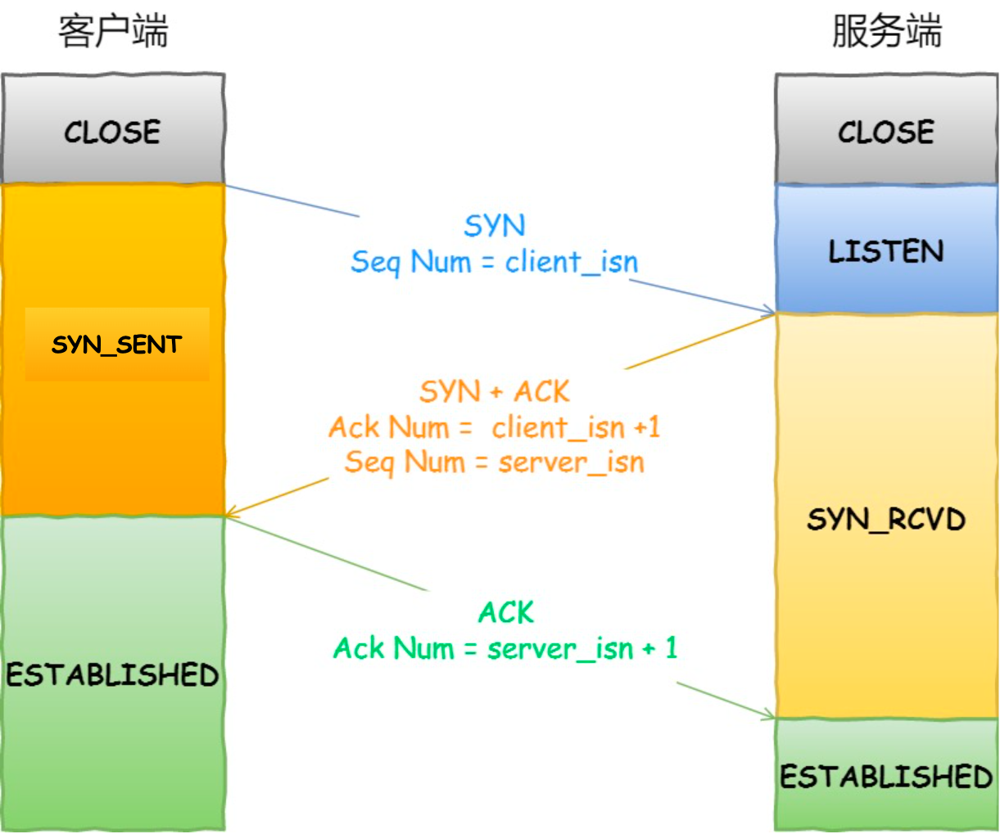
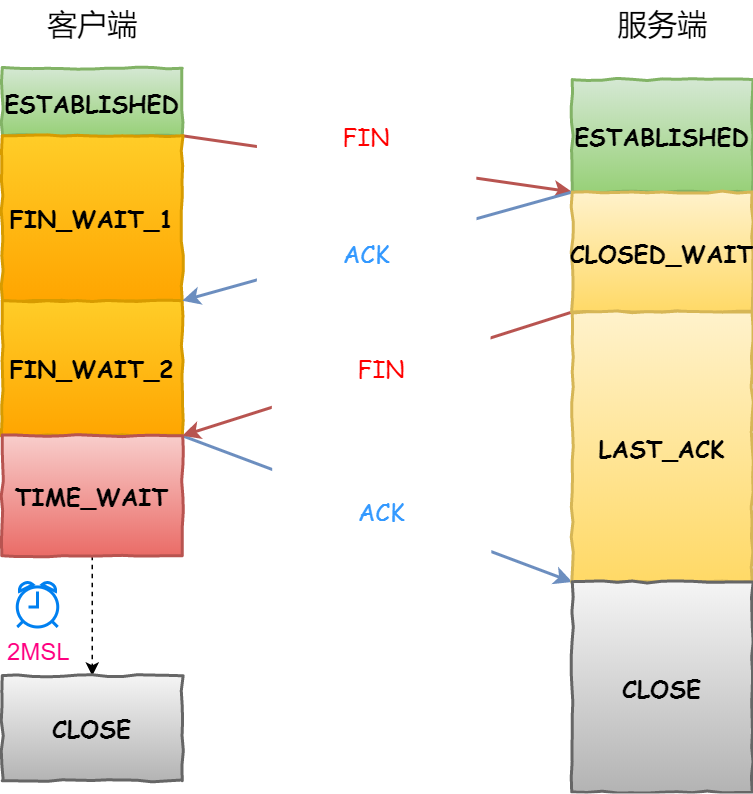

# TCP

TCP（Transmission Control Protocol 传输控制协议）是一个**面向连接的**、**可靠的**、**基于字节流**的传输层通信协议

::: tip TCP 连接

TCP 连接是用于保证可靠性和流量控制维护的某些状态信息的组合，这些信息包括 Socket、序列号和窗口大小

- **Socket**：由 IP 地址和端口号组成
- **序列号**：用来解决乱序问题等
- **窗口大小**：用来做流量控制

:::

::: tip TCP 四元组

- 源地址
- 源端口
- 目的地址
- 目的端口

TCP 四元组可以唯一的确定一个连接

:::

## 三次握手

> TCP 连接建立

**三次握手**是指在建立一个 TCP 连接时客户端和服务器总共要**发送 3 个数据包以确认连接的建立**

三次握手的过程如下图所示：

最开始时客户端和服务器都处于 `CLOSED` 状态。然后服务器主动监听某个端口（此时处于 `LISTEN` 状态）

### 第一次握手

> **由客户端发起**

客户端会随机初始化一个序列号（`client_isn`）然后发送一个带有 `SYN` `seq = client_isn` 信息的数据包。发送完成后客户端进入 `SYN_SEND` 状态（连接发送状态）

- `SYN` 是一个标志位，为 1 时表示希望建立连接
- `seq = client_isn` 是客户端随机初始化的序列号（一个 32 位的无符号数）

### 第二次握手

> **由服务器发起**

服务器收到客户端的 `SYN` 报文后，首先会随机初始化自己的序列号（`server_isn`）然后发送一个带有 `SYN` `ACK` `seq = server_isn` `ack = client_isn + 1` 信息的数据包。发送完成后服务器进入 `SYN_RCVD` 状态（连接收到状态）

- `ACK` 是一个标志位，表示收到了请求
- `seq = server_isn` 是服务器随机初始化的序列号（一个 32 位的无符号数）
- `ack = client_isn + 1` 是一个确认应答号，值为**客户端序列号 + 1**

### 第三次握手

> **由客户端发起**

客户端收到服务器报文后，会再发送一个带有 `ACK` `ack = server_isn + 1` 信息的数据包。发送完成后客户端进入 `ESTABLISHED` 状态（连接成功状态）服务器收到客户端发送的应答报文包后也会进入 `ESTABLISHED` 状态

- `ack = server_isn + 1` 是一个确认应答号，值为**服务器序列号 + 1**

::: tip 三次握手可以保证客户端和服务器能够确认双方的接收和发送能力是否正常

- 第一次握手：客户端发送 `SYN` 报文给服务器，服务器接收该报文
  - 客户端什么都不能确认
  - 服务器确认：自己接收正常，对方发送正常
- 第二次握手：服务器发送 `SYN + ACK` 报文给客户端，客户端接收该报文
  - 客户端确认：自己发送正常、接收正常，对方发送正常、接收正常
  - 服务器确认：自己接收正常，对方发送正常
- 第三次握手：客户端发送 `ACK` 报文给服务器
  - 客户端在第二次握手时已经完成确认
  - 服务器确认：自己发送正常，接收正常，对方发送正常、接收正常

:::

### 三次握手的作用？

1. 防止旧的重复连接初始化造成混乱
2. 同步双方初始序列号（序列号能够保证数据包不重复、不丢弃和按序传输）
3. 避免资源浪费

### 为什么不是两次握手?

两次握手无法防止历史连接的建立，会造成双方资源的浪费，也无法可靠的同步双方序列号

### 为什么不是四次握手?

因为通过前三次已经可以建立一个可靠的连接，如果再发送第四次确认消息会浪费资源，所以不需要使用更多的通信次数

### 三次握手过程中，可以携带数据吗？

第一次、第二次握手不可以携带数据，第三次握手可以携带数据，因为在第三次握手时客户端已经处于连接状态，已经知道服务器的接收、发送能力是正常的

## 四次挥手

> TCP 连接断开

**四次挥手**是指断开一个 TCP 连接时客户端和服务器总共**发送 4 个包以确认连接的断开** 
**客户端和服务器双方都可以主动断开连接**

四次挥手的过程如下图所示：

最开始时客户端和服务器都处于 `ESTABLISHED` 状态

### 第一次挥手

客户端先发送一个带有 `FIN=1` 信息的数据包，然后客户端进入 `FIN_WAIT_1` 状态

### 第二次挥手

服务器收到客户端的 `FIN` 报文后，就向客户端发送 `ACK` 应答报文，然后服务器进入 `CLOSED_WAIT` 状态 
当客户端收到服务器的 `ACK` 应答报文后会进入 `FIN_WAIT_2` 状态

### 第三次挥手

当服务器处理完数据后，会向客户端发送 `FIN` 报文，之后服务器进入 `LAST_ACK` 状态

### 第四次挥手

服务器收到服务器的 `FIN` 报文后，会回复一个 `ACK` 应答报文，之后进入 `TIME_WAIT` 状态 
服务器收到了 `ACK` 应答报文后，就进入了 `CLOSED` 状态（**服务器完成连接的关闭**） 
客户端在经过 `2MSL` 一段时间后会自动进入 `CLOSED` 状态（**客户端完成连接的关闭**）

::: tip 什么是 MSL

`MSL` 是 Maximum Segment Lifetime（**报文最大生存时间**）是任何报文在网络上存在的最长时间，超过这个时间报文将会被丢弃

`2MSL` 的时间是从客户端接收到 `FIN` 后发送 `ACK` 开始计时的。如果在 `TIME-WAIT` 时间内，因为客户端的 `ACK` 没有传输到服务器，客户端又接收到了服务器重发的 `FIN` 报文，那么 `2MSL` 时间将重新计时

:::

### 为什么挥手需要四次？

- 在关闭连接时客户端向服务器发送 `FIN` 时，仅表示客户端不再发送数据了但是还能接收数据；
- 当服务器在收到客户端的 `FIN` 报文时，会先回一个 `ACK` 应答报文，而服务器可能还有数据需要处理和发送，等服务器不再发送数据时，才发送 `FIN` 报文给客户端来表示同意现在关闭连接。

### 为什么需要 TIME_WAIT 状态？

> 主动发起关闭连接的一方才有 `TIME-WAIT` 状态

1. 防止历史连接中的数据，被后面相同四元组的连接错误的接收；
2. 保证**被动关闭连接**的一方，能被正确的关闭；

### 为什么 TIME_WAIT 等待的时间是 2MSL？

1. 保证服务器能收到最后的 `ACK` 应答报文
2. 让此次 TCP 连接中的所有报文在网络中消失，从而避免前后两个使用相同四元组的连接中的前一个连接的报文干扰后一个连接

假如客户端在送 `ACK` 后，这个 `ACK` 在 `1MSL` 时到达服务器，此时服务器在收到这个 `ACK` 的前一刹那，一直在重传 `FIN`，这个 `FIN` 最坏会在 `1MSL` 时间内消失。因此从客户端发送 `ACK` 的那一刹那开始，等待 `2MSL` 可以保证客户端发送的最后一个 `ACK` 和服务器发送的最后一个 `FIN` 都在网络中消失

## TCP 和 UDP

### TCP 和 UDP 的区别

- 1. **连接**
  - TCP 是面向连接的传输层协议，传输数据前先要建立连接；
  - UDP 是不需要连接，即刻传输数据。
- 2. **服务对象**
  - TCP 是一对一的两点服务，即一条连接只有两个端点；
  - UDP 支持一对一、一对多、多对多的交互通信。
- 3. **可靠性**
  - TCP 是可靠交付数据的，数据可以无差错、不丢失、不重复、按需到达；
  - UDP 是尽最大努力交付，不保证可靠交付数据。
- 4. **拥塞控制、流量控制**
  - TCP 有拥塞控制和流量控制机制，保证数据传输的安全性；
  - UDP 没有拥塞控制、流量控制，即使网络非常拥堵了，也不会影响 UDP 的发送速率。
- 5. **首部开销**
  - TCP 首部长度较长会有一定的开销，首部在没有使用“选项”字段时是 20 个字节，如果使用了“选项”字段则会变长的；
  - UDP 首部只有 8 个字节，并且是固定不变的，开销较小。
- 6. **传输方式**
  - TCP 是流式传输，没有边界，但保证顺序和可靠；
  - UDP 是一个包一个包的发送，是有边界的，但可能会丢包和乱序。
- 7. **分片不同**
  - TCP 的数据大小如果大于 MSS 大小，则会在传输层进行分片，目标主机收到后，也同样在传输层组装 TCP 数据包，如果中途丢失了一个分片，只需要传输丢失的这个分片。
  - UDP 的数据大小如果大于 MTU 大小，则会在 IP 层进行分片，目标主机收到后，在 IP 层组装完数据，接着再传给传输层。

> MSS（Maximum Segment Siz）最大分段大小：一个网络包中除去 IP 和 TCP 头部之后所能容纳的 TCP 数据的最大长度
> MTU（Maximum Transmission Unit）最大传输单元：一个网络包的最大长度（以太网中一般为 1500 字节）

### TCP 和 UDP 的应用场景

- TCP 面向连接，能保证数据的可靠性交付，因此经常用于：
  - FTP 文件传输
  - HTTP / HTTPS
- UDP 面向无连接，可随时发送数据，其本身的处理既简单又高效，因此经常用于：
  - 包总量较少的通信，如 DNS 、SNMP 等
  - 视频、音频等多媒体通信
  - 广播通信

### TCP 和 UDP 可以同时绑定相同的端口吗？

传输层的**端口号**是用于识别同一计算机中同时通信的不同应用程序，而 TCP 和 UDP 是两个不同的传输层协议，其在内核中是两个完全独立的软件模块。 
当主机收到数据包后，可以在 IP 包头的**协议号**字段知道该数据包是 TCP 还是 UDP，所以可以根据这个信息确定送给哪个模块 (TCP/UDP) 处理，送给 TCP/UDP 模块的报文根据**端口号**确定送给哪个应用程序处理。 
因此 TCP 和 UDP 各自的端口号是相互独立的，如 TCP 有一个 80 号端口，UDP 也可以有一个 80 号端口，二者并不冲突。

## TCP 相关学习文章

[TCP 三次握手与四次挥手面试题 —— 小林 coding](https://xiaolincoding.com/network/3_tcp/tcp_interview.html)
