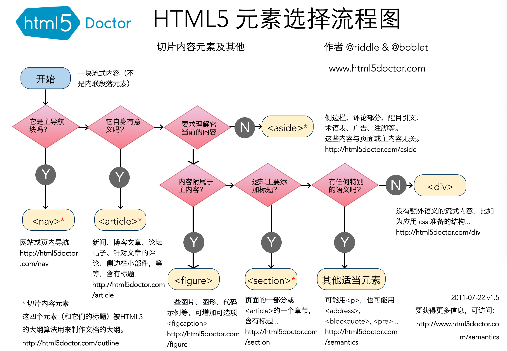

# HTML theoretical knowledge points

## HTML semantics

`HTML` semantics refers to selecting appropriate tags (code semantics) based on the structure of the content (content semantics), that is, **using the right tags to do the right thing**

::: tip Advantages of semantics

`HTML` semantics enhance document recognizability

- Allows the page to present a good content structure even without `CSS` style sheet
- Conducive to `SEO` optimization (crawlers rely on `HTML` tags to determine the weight of rendering keywords)
- Convenient for other devices to parse (screen readers, blind readers) to improve user experience
- Enhanced code readability and maintainability

:::

### Commonly used semantic tags

- `<article>`: indicates the main part of the article
- `<aside>`: Indicates the part that is not so relevant to the main body of the article, generally including navigation, advertising and other tool-like content.
- `
 and 
`: Indicate additional details that can be viewed or hidden
- `<figure> and <figcaption>`: represent streaming content such as images and photos related to the article
- `<footer>`: usually appears at the end, including author information, related links, copyright information, etc.
- `<header>`: represents navigation or introductory content
- `<h1> ~ <h6>`: Indicates titles at different levels in the article
- `<main>`: indicates the main content of the article
- `<nav>`: indicates navigation
  - In `header` it mostly represents the article directory
  - Most of the `aside` are related pages or whole site maps
- `<section>`: represents the "section" or "paragraph" in the article
- `<time>`: represents date or time

`HTML5` tag selection flow chart

[Semantics in HTML - MDN](https://developer.mozilla.org/zh-CN/docs/Glossary/Semantics)
