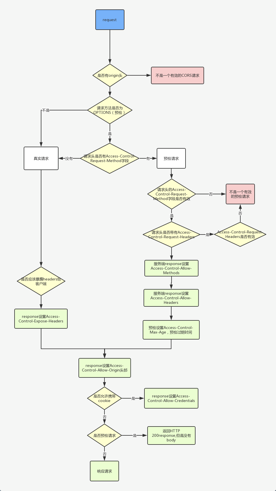

# 浏览器知识

## 基础知识

### 线程和进程

> 进程（process）和线程（thread）是操作系统的基本概念

进程是 CPU 资源分配的最小单位（是能拥有资源和独立运行的最小单位）<br />
线程是 CPU 调度的最小单位（是建立在进程基础上的一次程序运行单位）<br />

**一个进程就是一个程序的运行实例**：启动一个程序时，操作系统会为该程序创建一块内存，用来存放代码、运行中的数据和一个执行任务的主线程，我们把这样的一个运行环境叫**进程**

**线程是进程内的一个执行单元**：线程是不能单独存在的，是依附于进程并由进程来启动和管理的

::: tip 进程和线程的关系特点

- 进程是拥有资源的基本单位；线程是调度和分配的基本单位（是进程内的一个执行单元，也是进程内的可调度实体）
- 进程之间相互隔离，互不干扰
- 一个进程中可以并发执行多个线程
- 一个线程只能隶属于一个进程，而一个进程是可以拥有多个线程的（但至少有一个主线程）
- 同一进程的所有线程共享该进程的所有数据
- 进程中的任意一线程执行出错，都会导致整个进程的崩溃
- 当一个进程关闭之后，操作系统会回收进程所占用的内存

:::

### Chrome 打开一个页面会有几个进程？

> 最新的 Chrome 多进程架构图


- **浏览器主进程**：负责界面显示、用户交互、子进程管理，同时提供存储等功能
- **渲染进程**：负责将 `HTML` `CSS` 和 `JavaScript` 转换为用户可以与之交互的网页
  - 排版引擎 Blink 和 JavaScript 引擎 V8 都是运行在该进程中
  - 默认情况下 Chrome 会为每个 Tab 标签创建一个渲染进程
  - 出于安全考虑渲染进程都是运行在沙箱模式下
- **GPU 进程**：负责网页、Chrome 的 UI 界面的绘制
- **网络进程**：负责页面的网络资源加载（之前是作为一个模块运行在浏览器进程）
- **插件进程**：负责插件的运行（因为插件易崩溃所以需要通过插件进程来隔离，以保证插件崩溃不会对浏览器和页面造成影响）

[Chrome 架构：仅仅打开了 1 个页面，为什么有 4 个进程？—— 浏览器工作原理与实践](https://time.geekbang.org/column/article/113513)

## 跨域

::: tip 跨域的原因 —— 浏览器的同源策略

[同源策略](https://developer.mozilla.org/zh-CN/docs/Web/Security/Same-origin_policy)是浏览器一个重要的安全策略，它用于限制一个 `origin` 的文档或者它加载的脚本如何能与另一个源的资源进行交互。它能帮助阻隔恶意文档，减少可能被攻击的媒介

同源的定义是两个 `URL` 的 **协议**、**域名**(子域名 + 主域名)、**端口号** 都相同，否则就会出现跨域

:::

::: tip 同源策略的限制范围

1. 限制跨源网络访问: `AJAX` 请求不能发送
2. 限制跨源脚本 `API` 访问: `DOM` 无法获得
3. 限制跨源数据存储访问: `Cookie` `LocalStorage` 和 `IndexDB` 无法读取

一般常说的跨域指网络跨域

:::

### 常用的跨域解决方案

::: tip 常用的跨域解决方案

1. **CORS**
2. **JSONP**
3. Nginx 反向代理
4. WebSocket
5. postMessage
6. document.domain

:::

### CORS 跨源资源共享

[CORS (跨源资源共享)](https://developer.mozilla.org/zh-CN/docs/Web/HTTP/CORS) 是 [HTTP](https://developer.mozilla.org/zh-CN/docs/Glossary/HTTP) 的一部分，它允许浏览器向跨源服务器发出 `XMLHttpRequest` 请求，从而解决了 `AJAX` 只能同源使用的限制。

> `CORS` 需要浏览器和服务器同时支持，目前所有浏览器均已支持，只需服务器配置即可使用

浏览器将 `CORS` 请求分成两类: **简单请求**和**非简单请求**

#### 简单请求

::: tip 简单请求必须同时满足以下条件

> 日常开发只会关注前两点

- 请求方法是以下三种方法之一
  - `HEAD`
  - `GET`
  - `POST`
- 只使用了如下的安全首部字段，不得人为设置其他首部字段
  - `Accept`
  - `Accept-Language`
  - `Content-Language`
  - `Content-Type` 仅限以下三种
    - `application/x-www-form-urlencoded`
    - `multipart/form-data`
    - `text/plain`
- 请求中的任意 `XMLHttpRequestUpload` 对象均没有注册任何事件监听器(使用 `XMLHttpRequest.upload` 属性访问`XMLHttpRequestUpload` 对象)
- 请求中没有使用 `ReadableStream` 对象

:::

##### 简单请求基本流程

1. 浏览器会直接发出 `CORS` 请求并在请求头信息之中增加一个 `Origin` 字段(用来说明本次请求来自哪个源(协议 + 域名 + 端口))
2. 服务器判断 `Origin` 字段决定是否同意这次请求
   1. 通过请求会在响应头增加 `CORS` 相关的字段(以`Access-Control-`开头)
   2. 拒绝请求时不会增加 `CORS` 相关的字段，浏览器会抛出异常

::: tip 简单请求响应头中的 CORS 字段

- `Access-Control-Allow-Origin`: 只能是 `*`(接受任意域名的请求)或者是请求时 `Origin` 字段的值
- `Access-Control-Allow-Credentials`(可选): 是一个布尔值,表示是否允许发送 `Cookie`
- `Access-Control-Expose-Headers`(可选): `CORS` 请求时 `XMLHttpRequest` 对象的 `getResponseHeader()` 方法只能拿到 6 个基本字段：`Cache-Control、Content-Language、Content-Type、Expires、Last-Modified、Pragma`。如果想拿到其他字段就必须在 `Access-Control-Expose-Headers` 里面指定

:::

::: tip CORS 中的 Cookie 设置

`CORS` 请求默认不发送 `Cookie`，如果需要发送需要满足如下条件

- 服务器必须设置 `Access-Control-Allow-Credentials: true`
- `Access-Control-Allow-Origin` 字段不能为 `*`
- `AJAX` 请求的配置项需设置 `withCredentials = true`

:::

#### 非简单请求

非简单请求是那种对服务器有特殊要求的请求，如请求方法是 `PUT` 或 `DELETE`，或者 `Content-Type` 字段的类型是 `application/json`。<br />
非简单请求会在正式通信之前增加一次 `HTTP` 查询请求，称为**预检请求**，用于获取服务器是否允许该实际请求，同时避免跨域请求对服务器的用户数据产生预期之外的影响

::: tip 预检请求

预检请求用的请求方法是 `OPTIONS` 表示这个请求是用来询问的

- 在预检请求请求头信息里会包含如下字段
  - `Origin`: 表示本次请求来自哪个源
  - `Access-Control-Request-Method`: 用于列出浏览器的 `CORS` 请求会用到哪些 `HTTP` 方法
  - `Access-Control-Request-Headers`(可选): 指定浏览器 `CORS` 请求会额外发送的头信息字段
- 服务器通过后会在预检请求响应头中设置如下字段
  - `Access-Control-Allow-Origin`
  - `Access-Control-Allow-Credentials`(可选)
  - `Access-Control-Allow-Methods`: 表示服务器支持的所有跨域请求的方法(为了避免多次预检请求)
  - `Access-Control-Allow-Headers`: 表示服务器支持的所有头信息字段，不限于浏览器在预检中请求的字段
  - `Access-Control-Max-Age`(可选): 用来指定本次预检请求的有效期单位为秒，在有效期内将不发出另一条预检请求

:::

一旦服务器通过了预检请求，以后每次浏览器正常的 `CORS` 请求，就都跟简单请求一样会有一个 `Origin` 头信息字段。服务器的回应也都会有一个 `Access-Control-Allow-Origin` 头信息字段

::: details CORS 请求过程

:::

[参考资料 —— 跨域资源共享 CORS 详解](http://www.ruanyifeng.com/blog/2016/04/cors.html)

### JSONP

`JSONP` 是利用 `<script>` 标签没有跨域限制的漏洞，当前源可以得到从其他来源动态产生的 `JSON` 数据

**`JSONP` 请求过程流程**

1. 前端定义一个解析的回调函数
2. 创建 `script` 标签，其 `src` 指向接口地址并拼接好参数和回调函数名
3. 后端处理数据并将其拼接到前端传入的回调函数中(拼接好的数据必须是一个合法的 `JavaScript` 脚本 )
4. 浏览器执行后端返回的 `JavaScript` 脚本代码(调用定义好的回调函数)并删除刚创建的 `script` 标签

::: details JSONP 代码实现

```js
function normalizeParams(params) {
  if (!params) {
    return ''
  }
  return Object.keys(params)
    .map((key) => `${key}=${params[key]}`)
    .join('&')
}

function jsonp(url, params) {
  return new Promise((resolve) => {
    const callback = `jsonp_${Date.now()}`
    window[callback] = function (data) {
      resolve(data)
      document.body.removeChild(scriptEle)
    }
    params.cb = callback
    const scriptEle = document.createElement('script')
    scriptEle.src = `${url}${url.includes('?') ? '&' : '?'}${normalizeParams(params)}`
    document.body.appendChild(scriptEle)
  })
}

jsonp('https://www.baidu.com/sugrec', {
  prod: 'pc',
  wd: '跨域'
}).then((res) => {
  console.log(res)
})
```

:::

::: tip JSONP 跨域优缺点

- 优点: 实现简单，兼容性好
- 缺点
  - 只支持 `GET` 请求
  - 容易遭受 `XSS` 攻击

:::

[了解更多跨域解决方案请点击 —— 10 种跨域解决方案](https://juejin.cn/post/6844904126246027278)

## 浏览器缓存机制

- 1. 浏览器在发送请求前先判断是否命中强缓存
  - 命中则不发送请求直接使用缓存，否则进行下一步
- 2. 浏览器发送请求后会由服务器判断是否命中协商缓存
  - 命中则从缓存获取资源，否则进行下一步
- 3. 浏览器直接使用服务器返回的资源并更新缓存

### 强缓存（200 OK）

- `Expires` 是服务器告诉浏览器的缓存过期时间（值为 `GMT` 时间，即格林尼治时间）
  - `HTTP1.0` 的产物
  - 受本地时间影响
  - 设置的值为 `max-age=xxx`（xxx 是 秒）
- `Cache-Control` 用于控制缓存的行为
  - 是 `HTTP1.1` 的产物
  - 取值
    - `public`：允许被客户端和代理服务器缓存
    - `private`：只允许被客户端缓存（默认值）
    - `no-cache`：允许被客户端和代理服务器缓存，但在使用缓存时需要经过协商缓存来验证决定
    - `no-store`：所有内容都不会被缓存，即不使用强制缓存也不使用协商缓存每次请求都会下载完整的资源
    - `maxage=xxx`：设置客户端和代理服务器的缓存时间，表示缓存内容将在 xxx 秒后失效
    - `s-maxage=xxx`：设置代理服务器的缓存时间（优先级比 `max-age` 高）

::: warning Cache-Control 注意点
`no-cache` 名字存在误导，其并不是不缓存数据，只是在使用缓存时需要经过协商缓存来验证决定<br />
`max-age=0` 和 `no-cache` 效果一致
:::

#### 缓存位置

- 内存缓存（memory cache）
  - 快速读取（内存缓存将编译解析后的文件，直接存入该进程的内存中，占据该进程一定的内存资源，以方便下次运行使用时的快速读取）
  - 进程关闭时数据会被清除
  - 不请求网络资源，资源存在内存中一般 `JS` 和图片文件会存入内存
  - 状态码：`200（from memory cache）`
- 硬盘缓存（disk cache）
  - 写入硬盘文件进行 `I/O` 操作
  - 进程关闭时数据不会被清除
  - 速度比 `memory cache` 慢
  - 不请求网络资源，资源存在磁盘中一般非脚本会存在磁盘中，如 `css`
  - 状态码：`200（from disk cache）`
- 代理服务器缓存（server worker）
  - 可以拦截处理页面的所有网络请求
  - 仅 `HTTPS` 下可用、存在兼容问题
  - 状态码：`200（from service worker）`

### 协商缓存（304 Not Modified）

#### `Last-Modified` 和 `If-Modified-Since`

`Last-Modified` 表示资源的最后修改时间，值为 `GMT` 格式时间字符串，精确到秒

- 浏览器第一次请求时，服务器会在响应头中返回请求资源的上次更新时间 `Last-Modified`
- 当浏览器再次请求时，会在请求头中携带 `If-Modified-Since` 值为上次请求返回的 `Last-Modified`
- 服务器收到请求后，会根据请求头中的 `If-Modified-Since` 和该资源在服务器的最后被修改时间做对比
  - 大于 `If-Modified-Since` 重新返回资源文件，状态码为 200
  - 小于 `If-Modified-Since` 资源无更新继续使用缓存文件，状态码为 304

::: tip Last-Modified 存在的问题

- 时间精度为秒级会出现误差情况，对文件修改精度有严格要求的场景不能满足
- 在集群服务器上各个服务器上的文件时间可能不同
- 如果用旧文件覆盖新文件，因为时间更前浏览器不会请求旧文件
- 编辑了文件但未修改，会导致缓存失效

:::

#### ETag 和 If-None-Match

`ETag` 是服务器通过算法对资源内容计算出的一个唯一标识（文件 `hash`）其有强弱之分

- 强 `Etag`
  - `ETag: "<etag_value>"`
  - 资源发生任何改变都会立刻更新
  - 难生成，利于比较
- 弱 `Etag`（使用 `W/` 标识）
  - `ETag: W/"<etag_value>"`
  - 只在资源发生本质变化时更新
  - 易生成，不利于比较

##### 过程

- 浏览器第一次请求时，服务器会在响应头中返回当前资源文件的一个唯一标识 `ETag`
- 当浏览器再次请求时，会在请求头中携带 `If-None-Match` 值为上次请求返回的 `ETag`
- 通过接收的 `ETag` 和服务器重新生成的 `ETag` 进行对比
  - 不一致 重新返回资源文件，状态码为 200
  - 一致 资源无更新继续使用缓存文件，状态码为 304

::: tip Last-Modified 和 Etag 对比

- 精确度上：`Etag` 优于 `Last-Modified`
- 性能上：`Etag < Last-Modified` 每次生成 `ETag` 都需要进行读写操作，而 `Last-Modified` 只需要读取操作
- 优先级：服务器校验优先考虑 `Etag`（先判断 `Etag` 是否变化，如果 `Etag` 没有变化再判断 `Last-Modified`）

:::

### 应用场景

| 强缓存                                       | 协商缓存                      |
| -------------------------------------------- | ----------------------------- |
| 不常变化的文件<br />带 hash 值的 css js 图片 | 频繁变动的文件<br />html 文件 |

### 用户行为对缓存的影响

- 地址栏输入
  - 查找 `disk cache`（磁盘缓存）中是否有匹配，有则使用缓存，没有则发送网络请求
- 普通刷新（F5）
  - 因为浏览器 `tab` 标签并没有关闭，因此 `memory cache` （内存缓存）是可用的，会被优先使用，其次使用 `disk cache`（磁盘缓存）
  - 跳过强缓存规则，直接走协商缓存
- 强制刷新（Ctrl + F5）
  - 浏览器不使用缓存，因此发送的请求头部均带有 `Cache-control: no-cache` （为了兼容还带了 `Pragma: no-cache`）服务器直接返回 200 和最新内容。
  - 跳过所有缓存规则

## 浏览器存储

### Cookie

`Cookie`（也叫 `Web Cookie` 或浏览器 `Cookie`）是服务器发送到用户浏览器并保存在本地的一小块数据，它会在浏览器下次向同一服务器再发起请求时被携带并发送到服务器上。通常，它用于告知服务端两个请求是否来自同一浏览器，如保持用户的登录状态。`Cookie` 使基于无状态的 `HTTP` 协议记录稳定的状态信息成为了可能，`Cookie` 在存储时是以键值对的形式存在的

`Cookie` 主要用于以下三个方面：

- 会话状态管理（如用户登录状态、购物车、游戏分数或其它需要记录的信息）
- 个性化设置（如用户自定义设置、主题等）
- 浏览器行为跟踪（如跟踪分析用户行为等）

`Cookie` 的本职工作并非本地存储，而是“维持状态”，因当时并没有其它合适的存储办法而作为唯一的存储手段，所以会用其进行本地存储

#### Cookie 的生成和使用

- 服务器生成，通过 `http response header` 中的 `set-cookie`
- 在 `JavaScript` 中使用 `document.cookie` 进行读写

```js
/* 读取 */
document.cookie

/* 写入 */
document.cookie = 'name=maomao'
```

::: tip Cookie 的缺点

- `Cookie` 最大只能有 `4KB` 同时大多数浏览器对一个站点的 `Cookie` 个数也是有限制的
- 同一个域名下的所有请求都会携带 `Cookie` 从而带来不必要的开销和安全问题

:::

### Web Storage

[Web Storage](https://developer.mozilla.org/zh-CN/docs/Web/API/Web_Storage_API)是 `HTML5` 专门为浏览器存储而提供的数据存储机制，其大小限制为 `5MB ~ 10MB` ([去查看当前浏览器下 Web Storage 的容量限制](http://dev-test.nemikor.com/web-storage/support-test/))，数据仅保存在客户端不与服务器进行通信

`Web Storage` 提供了两种机制供我们使用

- `Local Storage`(本地存储)
- `Session Storage`(会话存储)

::: tip LocalStorage

- 保存的数据长期存在
- 在同源的所有标签页和窗口之间共享数据

:::

::: tip SessionStorage

- 数据只存在于当前浏览器的标签页
- **在新标签或窗口打开一个页面时会复制顶级浏览会话的上下文作为新会话的上下文**
  - 在当前标签中打开一个同域下的页面时会复制当前标签页中的 `SessionStorage` 数据
  - 复制的 `SessionStorage` 数据是独立的，不会相互影响(类似深拷贝)
- 重新加载或恢复页面仍会保持原来的数据
- 关闭对应浏览器标签或窗口后数据会被清除

:::

#### API 使用

> 以 `localStorage` 为例

```js
/* 存储数据 setItem() */
localStorage.setItem('name', 'maomao')

/* 读取数据 getItem() */
localStorage.getItem('name')

/* 删除指定数据 removeItem() */
localStorage.removeItem('name')

/* 清空数据 clear() */
localStorage.clear()
```

::: tip sessionStorage localStorage 和 cookie 的区别

- 相同点
  - 都是在客户端保存数据
  - 存储数据的类型都是字符串
- 不同点
  - 生命周期
    - `Cookie`: 可以设置失效时间(默认是关闭浏览器后失效)
    - `localStorage`: 除非被手动清除否则将会永久保存
    - `sessionStorage`: 仅在当前浏览器的标签页下有效，关闭标签或窗口后就会被清除
  - 数据大小
    - `Cookie`: 4KB
    - `localStorage` 和 `sessionStorage`: `5MB ~ 10MB`
  - http 请求
    - `Cookie`: 每次都会携带在 `HTTP` 请求头中
    - `localStorage` 和 `sessionStorage`: 仅在客户储保存不会与服务器通信

:::

### IndexedDB

[IndexedDB](https://developer.mozilla.org/zh-CN/docs/Web/API/IndexedDB_API) 是一个运行在浏览器上的非关系型数据库，用于**在客户端存储大量结构化数据**

::: tip IndexedDB 的特点

- 存储空间大(一般来说不少于 `250MB` 甚至没有上限)
- 支持存储二进制数据(`ArrayBuffer` 和 `Blob`)
- 键值对储存
- 同源限制
- 执行的操作是异步执行，以免阻塞应用程序
- 是一个事务型数据库系统

:::

#### API 使用

打开/创建一个 IndexedDB 数据库，并指定数据库的版本号 (版本号只能为整数)

```js
const request = window.indexedDB.open('myDatabase', 1)
let db

// 成功回调
request.onsuccess = function (event) {
  // 获取 indexedDB 实例
  db = event.target.result
  // 也可以使用 request.result 获取 indexedDB 实例
  console.log('连接 IndexedDB 成功')
}

// 失败回调
request.onerror = function () {
  console.log('连接 IndexedDB 失败')
}
```

创建一个对象仓库(类似于数据库中的表)

```js
// upgradeneeded 事件会在初始化数据库或版本发生更新时被调用
request.onupgradeneeded = function (event) {
  const db = event.target.result
  // 创建对象仓库并指定主键
  const objectStore = db.createObjectStore('userInfo', {
    keyPath: 'id',
    autoIncrement: false
  })
  console.log('创建对象仓库成功')

  /**
   * 定义存储对象的数据项
   * 第一个参数是创建的索引名称，可以为空
   * 第二个参数是索引使用的关键名称，可以为空
   * 第三个参数是可选配置参数，可以不传，常用参数之一就是 unique ，表示该字段是否唯一，不能重复
   */
  objectStore.createIndex('id', 'id', {
    unique: true
  })
  objectStore.createIndex('name', 'name')
}
```

添加数据

```js
// 创建事务指并定表格名称和读写权限
const transaction = db.transaction(['userInfo'], 'readwrite')
// 获取 Object Store 对象
const objectStore = transaction.objectStore('userInfo')

/* 添加数据 */
objectStore.add({ id: 1, name: 'test' })
```

获取数据

```js
const transaction = db.transaction(['userInfo'], 'readonly')
const objectStore = transaction.objectStore('userInfo')

const objectStoreRequest = objectStore.get(1)
objectStoreRequest.onsuccess = function () {
  console.log('获取数据', objectStoreRequest.result)
}
```

修改数据

```js
const transaction = db.transaction(['userInfo'], 'readwrite')
const objectStore = transaction.objectStore('userInfo')

const objectStoreRequest = objectStore.get(1)
objectStoreRequest.onsuccess = function () {
  const data = objectStoreRequest.result
  data.name = 'maomao'
  objectStore.put(data)
}
```

删除数据

```js
const transaction = db.transaction(['userInfo'], 'readwrite')
const objectStore = transaction.objectStore('userInfo')

const objectStoreRequest = objectStore.delete(1)
objectStoreRequest.onsuccess = function () {
  console.log('删除成功')
}
```

::: tip 在日常开发中可以使用如下类库简化代码量

- [localForage](https://github.com/localForage/localForage) 一个提供 `name:value` 的简单语法的客户端数据存储垫片，基于 `IndexedDB` 实现，并在不持支 `IndexedDB` 的浏览器中自动回退到 `WebSQL` 和 `localStorage`
- [Dexie.js](https://github.com/dexie/Dexie.js) 对 `IndexedDB` 的封装，通过提供更友好和简单语法进行快速的编码开发
- [PouchDB](https://github.com/pouchdb/pouchdb) 对 `IndexedDB` 的封装，通过提供更友好和简单语法进行快速的编码开发

:::
