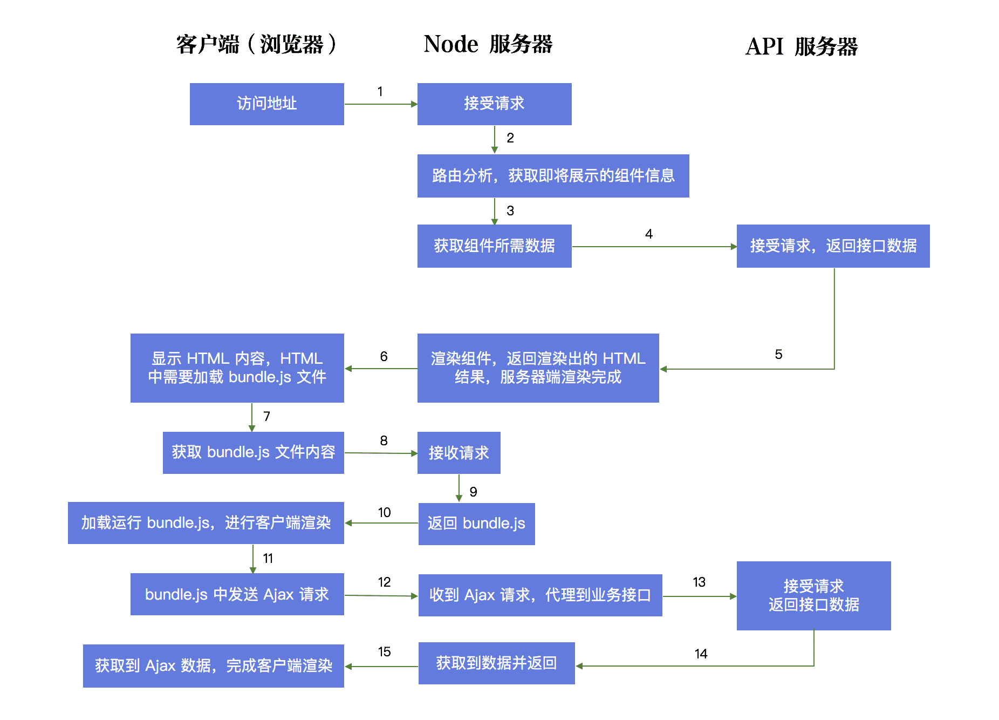

# 前端页面渲染方式

## CSR 客户端渲染

> `CSR` 客户端渲染（Client Side Rendering）

客户端渲染是指浏览器在请求页面 `URL` 后，服务端直接返回一个空的静态 `HTML` 文件，这个 HTML 文件需要再加载 `JavaScript` 脚本和 `CSS` 样式表，浏览器加载和执行这些文件去动态改变 `DOM` 树的结构，使页面渲染成用户所需要的界面，这种动态渲染的方式就是客户端渲染 （CSR）

### 优点

- **局部刷新**：无需每次都进行完整页面请求
- **懒加载**：首次加载时可以只加载可视区域内的数据
- 丰富的站点交互
- 减轻服务器压力
- 前后端分离

### 缺点

- 不利于 SEO
- **首屏渲染慢**：需要等待 `JavaScript` 脚本文件加载完毕后才开始渲染页面

::: tip SEO
SEO（Search Engine Optimization）：**搜索引擎优化**，利用搜索引擎的规则提高网站在有关搜索引擎内的自然排名。目的是让其在行业内占据领先地位，获得品牌收益。
:::

## SSR 服务端渲染

> `SSR` 服务端渲染（Server Side Rendering）

服务端渲染是指浏览器在请求页面 `URL` 时，服务端将我们需要的 `HTML` 文本组装好，并返回给浏览器，这个 `HTML` 文本被浏览器解析之后，不需要经过 `JavaScript` 脚本的下载过程，就能直接构建出我们所希望的 `DOM` 树并展示到页面中。这个服务端组装 `HTML` 的过程就叫做服务端渲染（SSR）

### 优点

- 有利于 SEO
- 首屏渲染快

### 缺点

- 占用服务器资源
- 用户体验不好：新页面都需要在服务端重新渲染整个页面，不能局部渲染
- 模板维护成本高

## 同构渲染

同构渲染是一种现代化服务端渲染方案，实际上是将 `CSR` 客户端渲染和 `SSR` 服务端渲染的优势结合起来实现互补； 
其流程是先在 `Node.js` 中进行服务端渲染生成 `HTML`，然后通过客户端渲染接管页面交互

- 同构：是指同一套代码可以**同时运行在服务端和客户端**
  - 路由同构
  - 数据同构
  - 渲染同构
- 脱水（`dehydrate`）：在服务端渲染直出 `HTML` 前将预取的数据注入到 `window` 中
- 注水（`hydrate`）：在客户端进行渲染前将 `window` 上绑定的数据传入到对应组件中

::: tip 为什么需要数据的脱水和注水？
保证服务端和客户端端渲染的组件具有相同的 `props` 和 `DOM` 结构
:::

### 优点

- 有利于 SEO
- 首屏渲染快
- **局部刷新**：无需每次都进行完整页面请求

### 缺点

- `Node` 服务的性能压力
- 服务端和浏览器环境的差异

### 开箱即用的 SSR 框架

- [Next.js](https://github.com/vercel/next.js) `React` 应用开发框架
- [Nuxt.js](https://github.com/nuxt/nuxt.js) `Vue.js` 通用应用框架

## SSG 静态站点生成

> `SSG` 静态网站生成（Static Site Generation）

静态站点生成是指在构建时就会为每个页面生成包含内容的 `HTML` 文件，当浏览器在请求页面 `URL` 时，服务端直接返回 HTML 即可。

### 优点

- 有利于 SEO
- 首屏渲染快
- 减轻服务器压力

### 缺点

- 每次更改内容时都需要重新构建和部署应用程序
- 无法生成用户相关内容

::: tip SSG 应用场景

SSG 适合应用在页面内容在构建时就能确定的场景

- 静态官网
- 文档网站

:::
