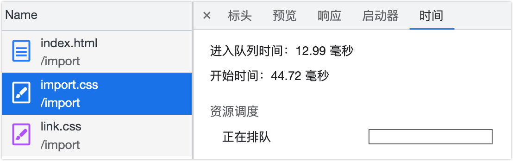
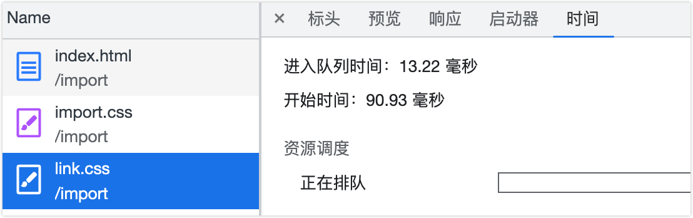

## 介绍一下盒模型

::: tip 什么是盒模型？

当对一个文档进行布局时，浏览器的渲染引擎会根据标准之一的 **`CSS` 基础框盒模型**（CSS basic box model），将所有元素表示为一个个矩形的盒子；`CSS` 决定这些盒子的大小、位置以及属性（如颜色、背景、边框尺寸等）

每个盒子（即盒模型）从外到内由这四个部分组成

- `margin` 外边距（不计入盒子的实际大小）
- `border` 边框
- `padding` 内边距
- `content` 内容

[CSS 基础框盒模型介绍 - CSS：层叠样式表 | MDN](https://developer.mozilla.org/zh-CN/docs/Web/CSS/CSS_Box_Model/Introduction_to_the_CSS_box_model)

:::

盒模型分为 **`W3C` 标准盒模型**和 **`IE` 盒模型**，其区别只有一个：**计算盒子实际大小（即总宽度/总高度）的方式不一样**

> 以宽度计算来举 🌰

- `W3C` 标准盒模型（默认）
  - **盒子实际宽 = `width` + `padding` + `border`**
  - 其中 **`width` 只包含 `content`**（即内容区域的宽度）
  - **通过 `box-sizing: content-box;` 来设置为 `W3C` 标准盒模型**
- `IE` 盒模型
  - **盒子实际宽 = `width`**
  - 其中 **`width` = `content` + `border` + `padding`**
  - **通过 `box-sizing: border-box;` 来设置为 `IE` 盒模型**

## 什么是 `BFC` ？

> 先了解一些前置知识：格式化上下文（Formatting Context）

::: tip 前置知识：格式化上下文（Formatting Context）
格式化上下文（Formatting Context）即 `FC`，**是 `Web` 页面中一种特殊的渲染区域，并有一套渲染规则，它决定了其元素如何排列、定位，以及和其他元素的关系和相互作用**

在 `CSS` 中，每个元素都属于一个特定的格式化上下文。有一些元素自带格式化上下文，例如根元素（`html`）、块级元素、浮动元素、绝对定位元素等。其他元素则可以通过一些 `CSS` 属性来创建自己的格式化上下文，例如 `display: inline-block`、`overflow: hidden`、`float: left` 等。
:::

> **相关资料**：
>
> - [Introduction to formatting contexts 格式化上下文简介 - CSS：层叠样式表 | MDN](https://developer.mozilla.org/zh-CN/docs/Web/CSS/CSS_Flow_Layout/Intro_to_formatting_contexts)
> - [块格式化上下文 | MDN](https://developer.mozilla.org/zh-CN/docs/orphaned/Web/Guide/CSS/Block_formatting_context)
> - [Block formatting contexts | W3C CSS2.1](https://www.w3.org/TR/CSS2/visuren.html#block-formatting)

`BFC` 即块级格式化上下文（Block Formatting Context），是 `Web` 页面中一种渲染模式，用于确定块级元素如何排列、定位和与其他元素交互，其相当于一个独立的容器，里面的元素和外部的元素相互不影响

### `BFC` 的布局规则

- `BFC` 内部的 `Box` 会在垂直方向，一个接一个的放置（**不会出现元素重叠**）
- `BFC` 中两个 `Box` 垂直方向的距离由 `margin` 决定
- **同一个 `BFC` 中两个相邻 `Box` 的垂直边距 `margin` 会发生重叠**，在不同的 `BFC` 中则不会发生重叠
- `BFC` 中每个子元素的左外边距（`margin-left`）与容器父元素的左边界相接触（`border-left`）
- `BFC` 中元素的布局不受外界的影响，也不会影响到外界的元素
  - 形成了 `BFC` 的区域**不会与浮动元素区域重叠**
  - **计算 `BFC` 的高度时，浮动元素也会参与计算**

### `BFC` 如何创建

- 根元素（`<html>`）
- 浮动元素：`float` 不为 `none`
- 绝对定位元素：`position` 为 `absolute` 或 `fixed`
- `display` 值为如下属性
  - `inline-block` 行内块元素
  - `flow-root` 块级元素盒
  - `table` 该行为类似于 `<table>` 元素
  - `table-cell` 该行为类似于 `<td>` 元素
  - `table-caption` 该行为类似于 `<caption>`
  - `table-row` 该行为类似于 `<tr>` 元素
  - `table-row-group` 该行为类似于 `<tbody>` 元素
  - `table-header-group` 该行为类似于 `<thead>` 元素
  - `table-footer-group` 该行为类似于 `<tfoot>` 元素
  - `inline-table` 内联表格
- `display` 值为 `flex` `inline-flex` `grid` `inline-grid` 的直接子元素，且它们本身都不是 `flex`、`grid`、 `table` 容器
- `contain` 值为 `layout`、`content` 或 `paint` 的元素
- `overflow` 不为 `visible` 和 `clip` 的块元素
- 多列容器：`column-count` 或 `column-width` 值不为 `auto`
- `column-span` 值为 `all`

### `BFC` 的应用场景

> 解决了什么问题

- 浮动元素高度塌陷
- 阻止元素被浮动元素覆盖
- 防止 `margin` 重叠（塌陷）
- 自适应布局

### 常见的格式化上下文总结

- `BFC`：块级格式化上下文（Block Formatting Context）
- `IFC`：行内格式化上下文（Inline Formatting Context）在 `IFC` 中元素会沿着基线对齐并按从左到右的顺序排列
- `TCFC`：表格单元格格式化上下文（Table Cell Formatting Context）在 `TCFC` 中表格的列宽会根据单元格的内容自动调整，而不会出现列宽不一致的情况
- `FFC`：弹性盒子格式化上下文（Flexbox Formatting Context）在 `FFC` 中弹性盒子元素可以按照自己的尺寸和顺序进行排列。
- `GFC`：网格格式化上下文（Grid Formatting Context）在 `GFC` 中网格元素可以按照网格的行和列进行排列

`FFC` 和 `GFC` 除布局之外规则与 `BFC` 块格式上下文类似，其容器中不存在浮动子元素，但排除外部浮动和阻止外边距重叠仍然有效

## 伪选择器（伪元素和伪类）

伪选择器包含**伪元素**和**伪类**，其都是添加到一个选择器末尾的关键字

### 伪元素

伪元素即伪元素选择器，**是通过元素内部创造假的元素**，其不能匹配任何真实存在的 `html` 元素，使用双冒号（`::`）语法

> 由于旧版本的 `W3C` 规范没有做约束，所以在绝大多数的浏览器中都同时支持双冒号和单冒号的写法

::: details 常用的伪元素选择器

- [`::before`](https://developer.mozilla.org/zh-CN/docs/Web/CSS/::before) 在选定元素的第一个子元素前插入内容
- [`::after`](https://developer.mozilla.org/zh-CN/docs/Web/CSS/::after) 在选定元素的最后一个子元素后插入内容
  - 都默认为行内元素
  - 都需要 [`content`](https://developer.mozilla.org/zh-CN/docs/Web/CSS/content) 属性配合（用于指定要插入的内容）
  - 都不能应用在替换元素上， 比如 `` 或 `<br />` 元素
- [`::first-line`](https://developer.mozilla.org/zh-CN/docs/Web/CSS/::first-line) 为块级元素第一行指定样式
  - 只能在块元素中使用（即 `display` 属性为这些值： `block`、`inline-block`、`table-cell`、`list-item` 或 `table-caption`）
- [`::first-letter`](https://developer.mozilla.org/zh-CN/docs/Web/CSS/::first-letter) 为块级元素第一行的第一个字符指定样式
  - 只能在块元素中使用（同 `::first-line`）
- [`::selection`](https://developer.mozilla.org/zh-CN/docs/Web/CSS/::selection) 为文档中被用户选中或处于高亮状态的部分指定样式
  - 仅这些样式可用：`color`、`background-color`、`cursor`、`caret-color`、`outline`、`text-decoration`、`text-emphasis-color`、`text-shadow`
- [`::placeholder`](https://developer.mozilla.org/zh-CN/docs/Web/CSS/::placeholder) 为一个表单元素的占位文本指定样式

:::

### 伪类

伪类即伪类选择器，**表示元素的某种状态**，使用单冒号（`:`）语法

::: details 常用的伪类选择器

- 用户行为伪类
  - [`:hover`](https://developer.mozilla.org/zh-CN/docs/Web/CSS/:hover) 手型经过伪类，鼠标经过时触发（主要使用在 `PC` 端，移动端也可以使用但消失不敏捷，体验不太好）
  - [`:active`](https://developer.mozilla.org/zh-CN/docs/Web/CSS/:active) 激活状态伪类，元素被点击时触发（主要用于点击反馈，键盘访问无法触发）
  - [`:focus`](https://developer.mozilla.org/zh-CN/docs/Web/CSS/:focus) 焦点伪类，元素处于聚焦状态时触发（其只能匹配特定的元素）
    - 非 `disabled` 状态的表单元素，如 `<input>`
    - 包含 `href` 属性的 `<a>` 元素
    - `＜area>` 元素（可以生效的 `CSS` 属性有限）
    - `<summary>` 元素
    - 设置了 `tabindex` 属性的普通元素
  - [`:focus-within`](https://developer.mozilla.org/zh-CN/docs/Web/CSS/:focus-within) 整体焦点伪类，在当前元素或其任意其子元素处于聚焦状态时触发
- `URL` 定位伪类
  - [`:link`](https://developer.mozilla.org/zh-CN/docs/Web/CSS/:link) 链接历史伪类，匹配页面上 `href` 属性没有被访问过的 `<a>` 元素
  - [`:any-link`](https://developer.mozilla.org/zh-CN/docs/Web/CSS/:any-link) 超链接伪类，匹配每一个有 `href` 属性的 `<a>`、`<area>` 或 `<link>` 元素
  - [`:target`](https://developer.mozilla.org/zh-CN/docs/Web/CSS/:target) 目标伪类，匹配锚点定位的元素（`url` 上 `hash` 值所对应的一个包含 `id` 选择器的元素）
- 输入状态伪类
  - [`:disabled`](https://developer.mozilla.org/zh-CN/docs/Web/CSS/:disabled) 禁用状态伪类，匹配被禁用的元素（主要是表单元素）
  - [`:read-only`](https://developer.mozilla.org/zh-CN/docs/Web/CSS/:read-only) 只读状态伪类，匹配输入框是否只读（只作用于 `<input>` 和 `<textarea>`）
  - [`:placeholder-shown`](https://developer.mozilla.org/zh-CN/docs/Web/CSS/:placeholder-shown) 占位符显示伪类，在 `<input>` 或 `<textarea>` 元素显示 `placeholder` 时生效
  - [`:default`](https://developer.mozilla.org/zh-CN/docs/Web/CSS/:default) 默认选项伪类，匹配处于默认状态下的表单元素
  - [`:checked`](https://developer.mozilla.org/zh-CN/docs/Web/CSS/:checked) 选中状态伪类，匹配任何处于选中状态的`<radio>`、`<checkbox>` 或 `select` 中的 `option` 元素
- 文档树结构伪类
  - [`:root`](https://developer.mozilla.org/zh-CN/docs/Web/CSS/:root) 匹配文档树的根元素（`<html>`），其除了优先级更高之外其他与 `html` 选择器相同
  - [`:empty`](https://developer.mozilla.org/zh-CN/docs/Web/CSS/:empty) 匹配没有没有子元素的元素，子元素只可以是元素节点或文本（包括空格）
  - [`:first-child`](https://developer.mozilla.org/zh-CN/docs/Web/CSS/:first-child) 匹配一组兄弟元素中的第一个元素
  - [`:last-child`](https://developer.mozilla.org/zh-CN/docs/Web/CSS/:last-child) 匹配一组兄弟元素中的最后一个元素
  - [`:only-child`](https://developer.mozilla.org/zh-CN/docs/Web/CSS/:only-child) 匹配没有任何兄弟元素的元素
  - [`:nth-child()`](https://developer.mozilla.org/zh-CN/docs/Web/CSS/:nth-child) 匹配指定位置序号的元素
  - [`:nth-last-child()`](https://developer.mozilla.org/zh-CN/docs/Web/CSS/:nth-last-child) 从后面匹配指定位置序号的元素
  - [`:first-of-type`](https://developer.mozilla.org/zh-CN/docs/Web/CSS/:first-of-type) 匹配当前标签类型元素的第一个
  - [`:last-of-type`](https://developer.mozilla.org/zh-CN/docs/Web/CSS/:last-of-type) 匹配当前标签类型元素的最后一个
  - [`:only-of-type`](https://developer.mozilla.org/zh-CN/docs/Web/CSS/:only-of-type) 匹配唯一的标签类型元素
  - [`:nth-of-type()`](https://developer.mozilla.org/zh-CN/docs/Web/CSS/:nth-of-type) 匹配指定索引的当前标签类型元素
  - [`:nth-last-of-type()`](https://developer.mozilla.org/zh-CN/docs/Web/CSS/:nth-last-of-type) 从后面匹配指定索引的当前标签类型元素
- 逻辑组合伪类
  - [`:not`](https://developer.mozilla.org/zh-CN/docs/Web/CSS/:not) 反选伪类（也可以叫反选伪类），匹配不符合一组选择器的元素
- 其他伪类
  - [`:fullscreen`](https://developer.mozilla.org/zh-CN/docs/Web/CSS/:fullscreen) 匹配当前处于全屏显示模式下的元素
  - [`:dir()`](https://developer.mozilla.org/zh-CN/docs/Web/CSS/:dir) 方向伪类，匹配特定文字书写方向的元素

:::

推荐阅读[张鑫旭的《CSS 选择器世界》](https://book.douban.com/subject/34846688/)

## 实现垂直水平居中

#### `text-align` + `line-height`

> 只能**在行内内容在一行时使用**（换行了就 GG），同时还需要**知道高度的具体值**

```css
.parent {
  height: 150px;
  /* 行高的值要与 height 一致 */
  line-height: 150px;
  text-align: center;
}
.child {
  /* 如果子元素是块级元素需要改为行内或行内块级才能生效 */
  display: inline-block;
  vertical-align: middle;
}
```

#### `absolute + transform`

```css
.parent {
  position: relative;
}
.child {
  position: absolute;
  left: 50%;
  top: 50%;
  tansform: translate(-50%, -50%);
}
```

#### `display: table-cell`

```css
.parent {
  display: table-cell;
  vertical-align: middle;
  text-align: center;
}
```

#### `flex`

```css
.parent {
  display: flex;
  justify-content: center;
  align-items: center;
}
```

#### `flex + margin`

```css
.parent {
  display: flex;
}
.child {
  margin: auto;
}
```

#### `grid`

```css
.parent {
  display: grid;
}
.child {
  justify-self: center;
  align-self: center;
}
```

#### `grid + margin`

```css
.parent {
  display: grid;
}
.child {
  margin: auto;
}
```

## `flex: 1` 代表什么？

[`flex`](https://developer.mozilla.org/zh-CN/docs/Web/CSS/flex) 是一个 `CSS` 简写属性，用于设置 `Flex` 项目如何增大或缩小以适应其 `Flex` 容器中可用的空间

::: tip `flex` 是 `flex-grow` `flex-shrink` `flex-basis` 属性的简写

- [flex-grow](https://developer.mozilla.org/zh-CN/docs/Web/CSS/flex-grow) 用于**设置 `flex` 项目的增长系数**
  - 负值无效
  - 初始值为 `0`
  - 省略时默认值为 `1`
- [flex-shrink](https://developer.mozilla.org/zh-CN/docs/Web/CSS/flex-shrink) 用于**设置 `flex` 项目的收缩系数**（仅在默认 `width/height` 之和大于容器时生效）
  - 负值无效
  - 初始值为 `1`
  - 省略时默认值为 `1`
- [flex-basis](https://developer.mozilla.org/zh-CN/docs/Web/CSS/flex-basis) 用于**设置 `flex` 项目在主轴方向上的初始大小**
  - 初始值为 `auto`
  - 省略时默认值为 `0`

:::

### `flex` 缩写语法规则

### 单值语法规则

```css{17,18}
/* 全局属性值 */
/* 初始值 */
flex: initial; => flex: 0 1 auto
/* 从其父级继承 (flex 属性不可被继承，将设置为初始值) */
flex: inherit; => flex: 0 1 auto
/* 是关键字 initial 和 inherit 的组合(当属性可继承时为 inherit 不可继承时为 initial) */
flex: unset; => flex: 0 1 auto


/* 关键字值 */
/* 根据自身的宽度与高度来确定尺寸 弹性 */
flex: auto; => flex: 1 1 auto
/* 根据自身宽高来设置尺寸 非弹性 */
flex: none; => flex: 0 0 auto


/* 无单位数: flex-grow（标题答案）*/
flex: 1; => 1 1 0
flex: 0; => 0 1 0


/* 一个有效的 width/height 值: flex-basis */
flex: 10px; => 1 1 10px
flex: 20em; => 1 1 20em
flex: min-content; => 1 1 min-content
```

### 双值语法规则

1. **第一个值必须为一个无单位数**
2. 第二个值必须为以下之一
   1. **无单位数**：当作 `flex-shrink` 值
   2. **有效的 `width/height` 值**：当作 `flex-basis` 值

```css
/* 无单位数: flex-grow | flex-shrink */
flex: 2 2; => 2 2 0

/* 有效的 width/height 值: flex-grow | flex-basis */
flex: 2 30px; => 2 1 30px
```

### 三值语法规则

1. **第一个值必须为一个无单位数**，当作 `flex-grow` 值
2. **第二个值必须为一个无单位数**，当作 `flex-shrink` 值
3. **第三个值必须为一个有效的 `width/height` 值**，当作 `flex-basis` 值

```css
flex: 2 2 10%;
```

[`Flex` 语法和计算规则](https://github.com/maomao1996/daily-notes/issues/23)

## `link` 和 `@import` 加载样式的区别

[`<link>`](https://developer.mozilla.org/zh-CN/docs/Web/HTML/Element/link) 是一个 `HTML` 标签，其规定了当前文档与外部资源的关系

[`@import`](https://developer.mozilla.org/zh-CN/docs/Web/CSS/@import) 是一个 `CSS` 语法规则，用于从其他样式表导入样式规则

::: tip `link` 和 `@import` 加载样式的区别

- 从属关系
  - `<link>` 是一个 `HTML` 标签，只能出现在 `<head>` 标签中
  - `@import` 是一个 `CSS` 语法规则，只能在 `<style>` 标签和 `CSS` 文件中使用
- 应用范围
  - `<link>` 标签用于链接各种类型的外部资源（这里只举三个 🌰）
    - 加载 `CSS`：`<link rel="stylesheet" href="/index.css" />`
    - 加载网站图标（`favicon`）：`<link rel="icon" href="favicon.ico" />`
    - `DNS` 预解析：`<link rel="dns-prefetch" href="https://notes.fe-mm.com">`
  - `@import` 只能用于引入 `CSS`
- 加载顺序
  - `<link>` 会在浏览器加载页面时同时加载（多个 `<link>` 会并行加载）
  - `@import` 会在浏览器解析到 `CSS` 中的 `@import` 时再加载（多个 `@import` 会串行加载）
- `DOM` 可控性
  - `<link>` 可以通过 `JavaScript` 操作 `DOM` 进行插入
  - `@import` 没有 `DOM` 接口，无法通过 `JavaScript` 操作

:::

::: warning 关于 `@import` 的加载顺序

网上很多文章都说 `@import` 引入的 `CSS` 将在页面加载完毕后被加载，其实这个说法是有问题的，比如下面这段代码，我在 `style` 标签里面使用的 `@import`，难道还要在页面加载完毕后再去加载

```html
<!doctype html>
<html>
  <head>
    <title>关于 @import 的加载顺序</title>
    <!-- 在 style 中使用 import 引入 css -->
    <style>
      @import url(./import.css);
    </style>
    <!-- 使用 link 引入 css -->
    <link href="./link.css" rel="stylesheet" />
  </head>
  <body>
    关于 @import 的加载顺序
  </body>
</html>
```

然后打开浏览器 `network` 面板去查看具体资源的加载时间

> `import.css` 排队时间



> `link.css` 排队时间



所以 `@import` 的加载顺序要看其写在哪里，而不能一概而论

:::
